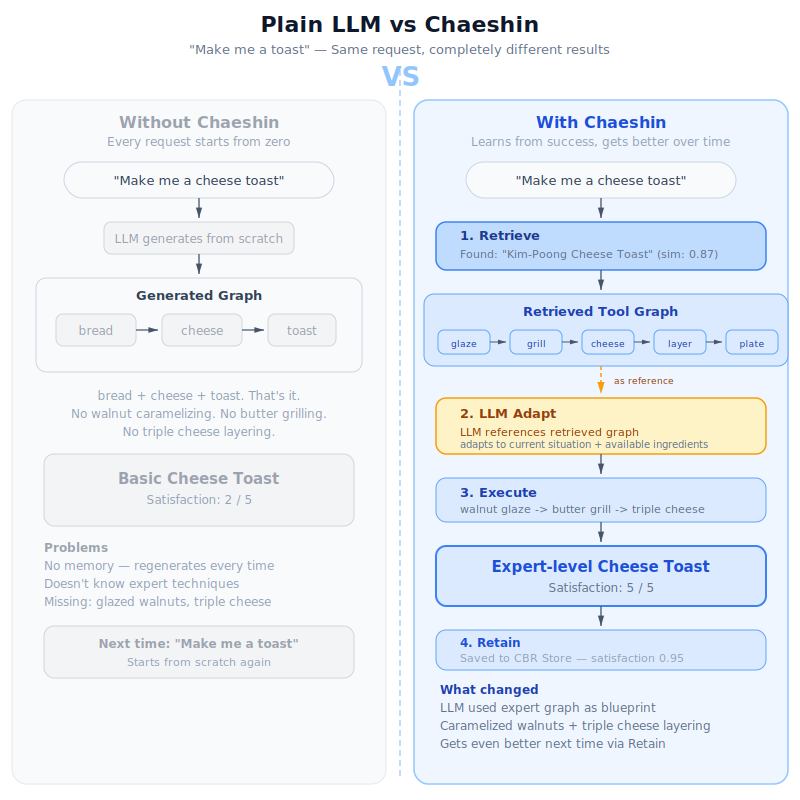
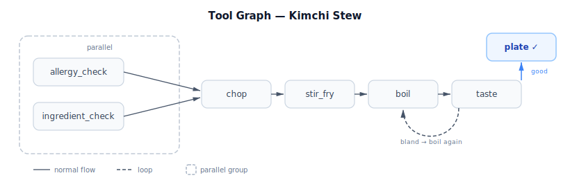
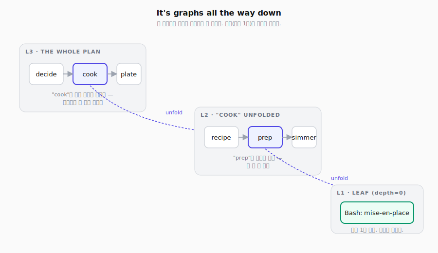
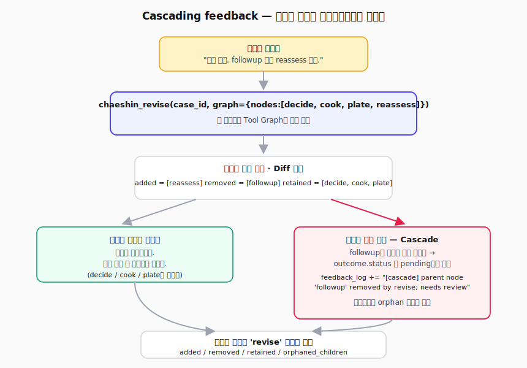
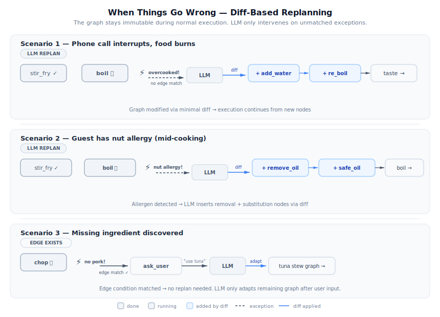
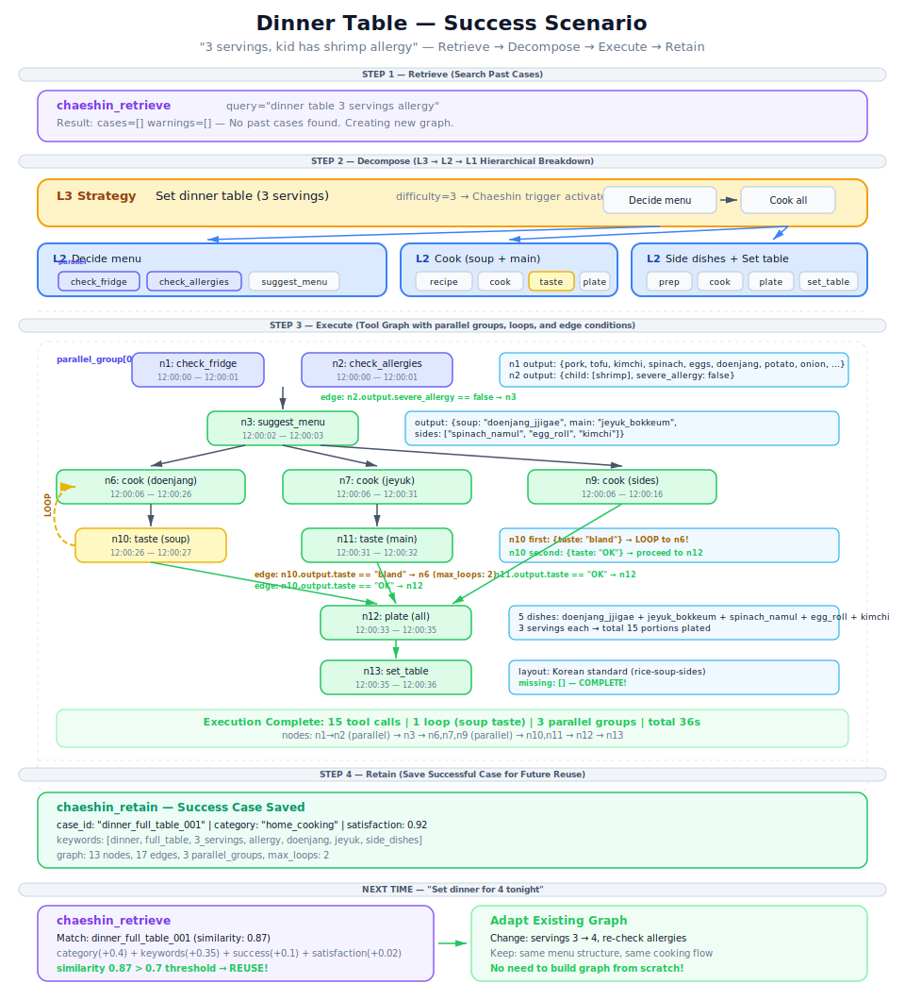
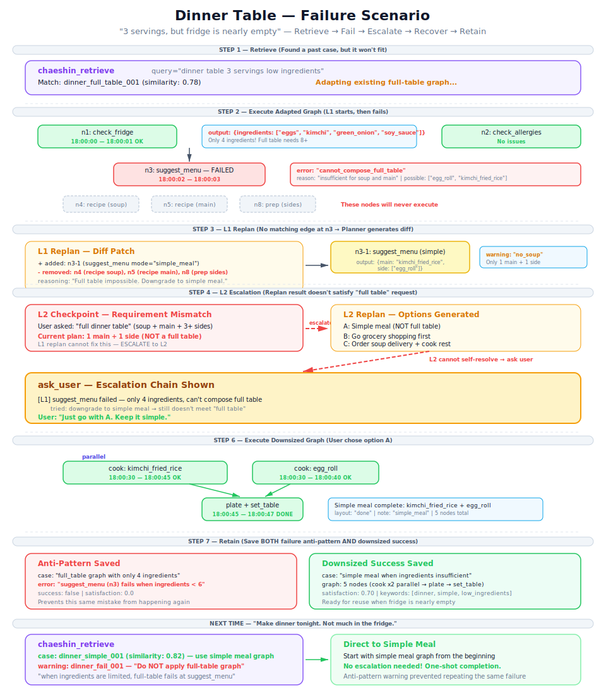
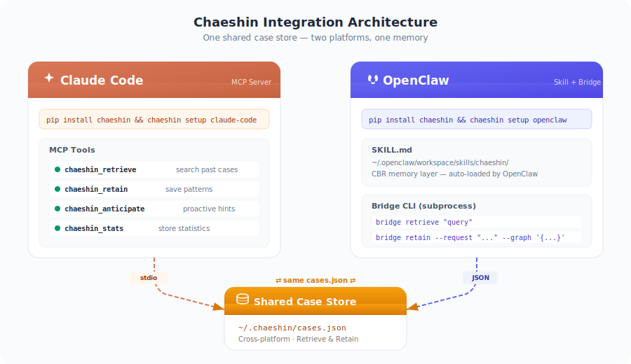
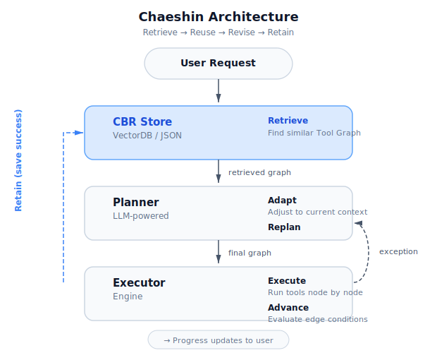

# Chaeshin (채신) 採薪

**LLM agents that remember what worked.** Instead of improvising tool calls every time, Chaeshin stores successful execution patterns and reuses them — so your agent gets better with every task.

<p align="center">
  
</p>

[한국어](docs/ko/README.md) | [中文](docs/zh/README.md) | [日本語](docs/ja/README.md) | [Español](docs/es/README.md) | [Français](docs/fr/README.md) | [Deutsch](docs/de/README.md)

---

## The Problem

Most LLM agents either **improvise** tool calls on the fly or follow **hardcoded** pipelines:

- **Improvised** (ReAct-style): Skips steps, wrong order, repeats the same mistakes.
- **Hardcoded**: Every new scenario needs code changes. Doesn't scale.

## The Fix

Chaeshin remembers what worked. When a similar request comes in, it retrieves a proven tool execution graph, adapts it, runs it, and saves the result. This is [Case-Based Reasoning](https://en.wikipedia.org/wiki/Case-based_reasoning): **Retrieve → Reuse → Revise → Retain.**

Failures are saved too — so the same mistake never happens twice.

```
Day 1:   Agent improvises everything from scratch
Day 7:   20 cases saved — common patterns are reused
Day 30:  100+ cases — agent rarely improvises, follows proven patterns
```

---

## Quick Start

### 1. Install

```bash
pip install chaeshin
```

### 2. Connect to your agent

```bash
chaeshin setup claude-code       # Claude Code (MCP + auto-learning)
chaeshin setup claude-desktop    # Claude Desktop
chaeshin setup openclaw          # OpenClaw
```

That's it. Claude now automatically:
- **Before** multi-step tasks → retrieves past patterns
- **After** completing tasks → saves the execution graph
- **On failure** → saves the failed pattern so it's never repeated

<details>
<summary>Other install methods</summary>

With [uv](https://docs.astral.sh/uv/) (recommended):

```bash
uv pip install chaeshin
```

With `uvx` (no global install):

```bash
uvx chaeshin setup claude-code --uvx
```

Manual MCP setup (add to `~/.claude.json`):

```json
{
  "mcpServers": {
    "chaeshin": {
      "command": "uv",
      "args": ["tool", "run", "chaeshin-mcp"]
    }
  }
}
```
</details>

<details>
<summary>Use as a standalone library (any agent)</summary>

```python
from chaeshin import CaseStore, ProblemFeatures

store = CaseStore()
store.load_json(open("cases.json").read())

results = store.retrieve(ProblemFeatures(request="send daily PR summary to slack"))
if results:
    graph = results[0][0].solution.tool_graph
```
</details>

### 3. Try the demo

```bash
git clone https://github.com/GEOHYEON/chaeshin.git && cd chaeshin
uv sync --all-extras
uv run python -m examples.cooking.chef_agent   # no API key needed
```

<details>
<summary>LLM + VectorDB demo (OpenAI + ChromaDB)</summary>

```bash
cp .env.example .env         # add your OPENAI_API_KEY
uv run python -m examples.cooking.chef_agent_llm
```
</details>

<details>
<summary>Web UI demo (Gradio)</summary>

```bash
cp .env.example .env
uv run python -m examples.cooking.app
```
</details>

See the [Quick Start Guide](docs/quickstart.md) for a full walkthrough.

---

## How It Works

### Tool Graph

Tool calls are structured as a **graph** — not a simple list. Nodes are tool invocations; edges define order and conditions. Loops are supported (e.g., "taste → too bland → cook more → taste again").

<p align="center">
  
</p>

### It's Graphs All the Way Down

Every layer is a graph. **Zoom in on any node — and you find another graph.** L2 isn't a "separate" graph linked to L3; L2 *is what you see when you unfold one L3 node*. Graph structure is preserved at every depth of zoom.

<p align="center">
  
</p>

You keep unfolding nodes until every leaf is a single tool call. How many zoom levels that takes is up to the problem — simple requests stop at `depth=0`, tangled ones go `L4`, `L5`, deeper. There's no fixed count.

Under the hood: each "fold" is a separate `Case` with its own `solution.tool_graph`, and `metadata.parent_node_id` records which node in the upper graph you unfolded. But the mental model is one recursive structure, not a stack of distinct graphs.

### Cascading Feedback — Edit a Layer, Downstream Reacts

Edit the graph at any zoom level and Chaeshin propagates the change to the deeper layers automatically:

<p align="center">
  
</p>

Orphans aren't deleted — in high-stakes domains a human decides whether to revise, re-link to a different parent node, or retire them. `added_nodes` are returned so the host AI can decide whether each new node is atomic (leaf tool call) or still composite (unfold into yet another graph).

This is why `chaeshin_revise` is a first-class tool — distinct from `chaeshin_update`. Graph edits at one zoom level ripple through every deeper level, and Chaeshin does the bookkeeping.

### Immutable Graph + Mutable Context

The graph never changes during execution. Only the **execution context** (cursor, node states, outputs) updates. If something unexpected happens and no edge matches, the LLM modifies the graph via a minimal **diff** — not a full regeneration.

### Diff-Based CRUD

Cases support full Create / Read / Update / Delete:
- `chaeshin_retain` — Create (always as `pending` outcome)
- `chaeshin_retrieve` — Read (split into successes / failures / pending)
- `chaeshin_update(case_id, patch)` — shallow merge; changed fields are recorded in the event log
- `chaeshin_delete(case_id, reason)` — removes a case

### Tri-State Outcome + User Verdict

Chaeshin never *infers* success or failure. Every new case starts as `pending` — the "중간" in-between state. The authoritative verdict comes from the user via `chaeshin_verdict(case_id, "success"|"failure", note)`.

- `wait_mode="blocking"` — wait indefinitely for verdict
- `wait_mode="deadline"` (default, 2h) — after the deadline the case stays `pending` forever; the agent stops blocking on it and moves on

No answer ≠ failure. No answer ≠ success. No answer = **pending** — and that's a first-class state.

### When Things Go Wrong

Real execution doesn't always follow the plan. Chaeshin handles this through **diff-based replanning**:

<p align="center">
  
</p>

---

## Full Example — Setting a Dinner Table

A complete walkthrough: "Prepare dinner for 3, kid has shrimp allergy." Shows every step — retrieve, decompose into layers, parallel cooking, taste-check loops, and failure escalation.

<p align="center">
  
</p>

<p align="center">
  
</p>

Full scenario with step-by-step explanations:
[English](examples/dinner-table/scenario_en.md) ·
[한국어](examples/dinner-table/scenario_ko.md) ·
[日本語](examples/dinner-table/scenario_ja.md) ·
[中文](examples/dinner-table/scenario_zh.md)

---

## Domain Examples

Two long-form walkthroughs showing the same three features (recursive graph decomposition, tri-state outcome, cascading revise) in very different domains.

### 🏥 Clinical Lifestyle Intake — high-stakes, long verdict cycle
A clinician-patient flow for newly-diagnosed Type-2 diabetes. Recursive decomposition into intake / stratify / plan / follow-up, FHIR R5 resource hooks, 12-week `pending` verdicts.

[📋 scenario](examples/medical_intake/scenario_ko.md) · runnable: `uv run python -m examples.medical_intake.demo`

### 🏃 Lifestyle Coaching (non-medical) — chronic fatigue reset
A 3-month reset plan for a burned-out startup PM. Same structure, no medical terminology. Minimum-load planning, cascade revise when the 10-min home workout doesn't stick, failed-habit archive that warns future similar clients.

[📋 scenario](examples/lifestyle_coaching/scenario_ko.md) · runnable: `uv run python -m examples.lifestyle_coaching.demo`

Both examples are standalone — read either first. They use parallel scenario structure (T0 intake → weekly feedback → cascade revise → final verdict → reuse by similar client), so comparing them side-by-side shows the same engine working in different contexts.

---

## Integrations

All platforms share `~/.chaeshin/cases.json` — cases saved in Claude Code work in OpenClaw and vice versa.

<p align="center">
  
</p>

| Platform | Command | What it does |
|----------|---------|-------------|
| Claude Code | `chaeshin setup claude-code` | MCP server + auto-learning rules (`CLAUDE.md`) |
| Claude Desktop | `chaeshin setup claude-desktop` | Auto-edits `claude_desktop_config.json` |
| OpenClaw | `chaeshin setup openclaw` | Installs `SKILL.md` into workspace |

Available MCP tools after setup:

| Tool | Description |
|------|-------------|
| `chaeshin_retrieve` | Search past cases — returns `successes` / `failures` / `pending` separately |
| `chaeshin_retain` | Save a tool graph. Always starts as `pending` until a verdict arrives |
| `chaeshin_update` | Diff-based partial update (shallow merge, changes logged) |
| `chaeshin_delete` | Remove a case (reason logged) |
| `chaeshin_verdict` | User's `success`/`failure` verdict → flips a pending case |
| `chaeshin_feedback` | Record free-form user feedback (escalate / modify / correct / …) |
| `chaeshin_decompose` | Return recursive-decomposition context for the host AI to execute |
| `chaeshin_stats` | Case store + outcome-status distribution + overdue-pending count |

---

## Monitor — Observability UI

<p align="center">
  
</p>

A Next.js dashboard over the live SQLite store at `~/.chaeshin/chaeshin.db`. Three views:

| Route | What you see |
|-------|--------------|
| `/` (Cases) | Visual graph editor — drag-and-drop nodes, edges, conditions; full CRUD |
| `/events` | Timeline of every MCP call (retrieve / retain / update / verdict / delete / feedback / decompose). 5-second auto-refresh. Click any row to expand payload + session_id + matched case_ids |
| `/hierarchy` | Recursive case tree. Filter by layer (L1…Ln) and by outcome status (pending / success / failure). Hover a pending case → inline **✓ 성공 / ✗ 실패** buttons to post a user verdict |

```bash
cd chaeshin-monitor && pnpm install && pnpm dev
```

The monitor writes verdicts directly to the same DB the MCP server reads from — so a verdict clicked in the UI immediately affects future `chaeshin_retrieve` rankings.

---

## Architecture

<p align="center">
  
</p>

<details>
<summary>Project structure</summary>

```
chaeshin/
├── schema.py               # Core data types — tri-state Outcome, recursive CaseMetadata (depth, wait_mode, deadline_at)
├── case_store.py           # CBR 4R cycle + update_case (diff merge) + set_verdict
├── event_log.py            # Every MCP call → SQLite events table (observability)
├── storage/
│   └── sqlite_backend.py   # ~/.chaeshin/chaeshin.db — cases, events, hierarchy_edges, embeddings
├── migrations/
│   ├── m001_json_to_sqlite_l1.py   # Legacy cases.json → SQLite + flat→L1 normalization
│   └── m002_outcome_status.py      # Backfill outcome.status on existing cases
├── graph_executor.py       # Tool graph runner (parallel, loops, conditions)
├── planner.py              # LLM-based graph create / adapt / replan (diff-based)
├── cli/                    # chaeshin setup claude-code / claude-desktop / openclaw
├── integrations/
│   ├── claude_code/        # FastMCP server (8 tools) + CLAUDE.md auto-learning template
│   ├── openclaw/           # SKILL.md + bridge CLI
│   ├── openai.py           # LLM + embedding adapter
│   ├── chroma.py           # ChromaDB vector case store (alt backend)
│   └── chaebi.py           # Chaebi marketplace sync
└── agents/                 # Orchestrator, Decomposer, Executor, Reflection
chaeshin-monitor/           # Next.js 15 UI — /, /events, /hierarchy (better-sqlite3 over the same DB)
examples/cooking/           # Demo agent (kimchi stew, doenjang stew, recovery scenarios)
examples/dinner-table/      # Recursive decomposition walkthrough (4 languages)
examples/medical_intake/    # Clinician lifestyle intake → adaptive plan (FHIR-aware)
examples/lifestyle_coaching/ # Chronic-fatigue reset plan — non-medical parallel to medical_intake
```
</details>

## Requirements

- Python 3.10+
- No required dependencies for core usage
- Optional: `openai` (LLM adapter), `chromadb` (vector store), `httpx` (Chaebi marketplace)

## Related Work

Chaeshin builds on ideas from:

- [CBR for LLM Agents (2025)](https://arxiv.org/abs/2504.06943) — CBR + LLM integration survey
- [DS-Agent (ICML 2024)](https://arxiv.org/abs/2402.17453) — CBR-based data science agent
- [Voyager (NeurIPS 2023)](https://arxiv.org/abs/2305.16291) — Skill library with experience-driven learning
- [GAP (2025)](https://arxiv.org/html/2510.25320v1) — Parallel tool execution via graphs
- [HTN Plan Repair (2025)](https://arxiv.org/abs/2504.16209) — Hierarchical plan repair

**What's different?** Tool graphs stored as CBR cases, general graphs with loops (not just DAGs), diff-based modification instead of full regeneration, and hybrid execution where code handles normal flow while the LLM only intervenes on exceptions.

## License

MIT — see [LICENSE](LICENSE)

---

*敎子採薪 — Don't give firewood; teach how to gather it.*
