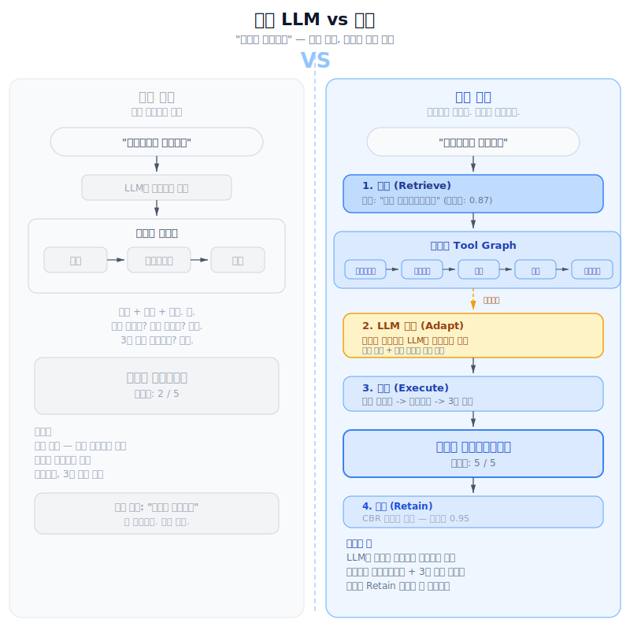
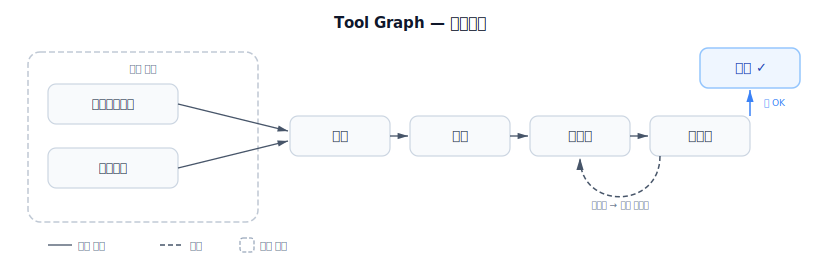
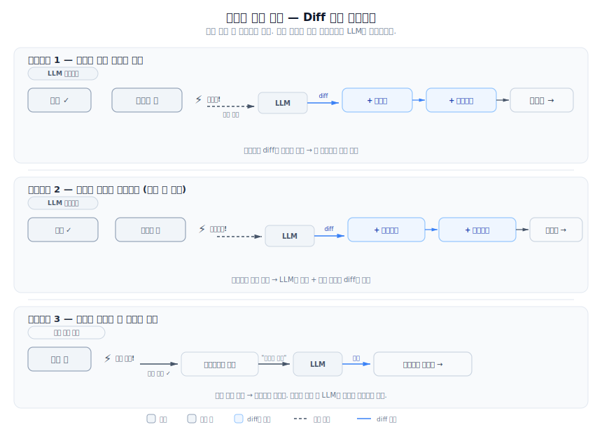
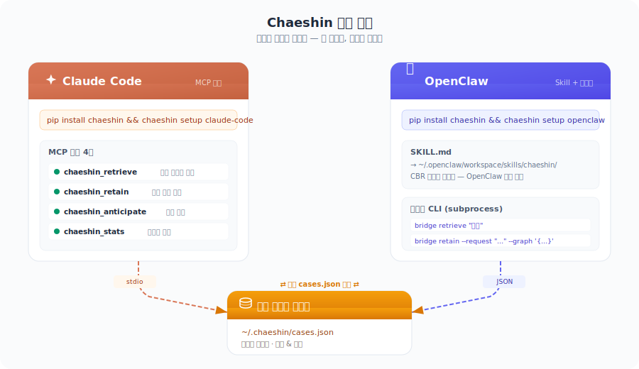
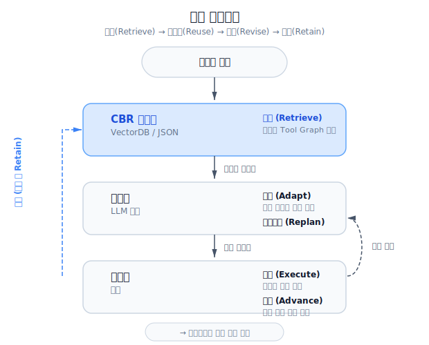

# 채신 (Chaeshin) 採薪

**성공한 패턴을 기억하는 LLM 에이전트.** 매번 도구 호출을 즉흥적으로 하는 대신, 채신은 성공한 실행 패턴을 저장하고 재사용합니다. 작업할수록 에이전트가 똑똑해집니다.

<p align="center">
  
</p>

[English](../../README.md) | [中文](../zh/README.md) | [日本語](../ja/README.md) | [Español](../es/README.md) | [Français](../fr/README.md) | [Deutsch](../de/README.md)

---

## 문제

대부분의 LLM 에이전트는 도구 호출을 **즉흥적으로** 하거나 **고정된** 파이프라인을 따릅니다:

- **즉흥형** (ReAct 방식): 단계를 빼먹고, 순서를 틀리고, 같은 실수를 반복합니다.
- **고정형**: 새로운 상황마다 코드를 고쳐야 합니다. 확장이 어렵습니다.

## 해결

채신은 잘 됐던 걸 기억합니다. 비슷한 요청이 들어오면 검증된 도구 실행 그래프를 꺼내서, 상황에 맞게 수정하고, 실행한 뒤, 결과를 다시 저장합니다. 이것이 [Case-Based Reasoning](https://ko.wikipedia.org/wiki/%EC%82%AC%EB%A1%80_%EA%B8%B0%EB%B0%98_%EC%B6%94%EB%A1%A0): **Retrieve → Reuse → Revise → Retain** 사이클입니다.

실패도 함께 저장합니다 — 같은 실수가 두 번 일어나지 않도록.

```
Day 1:   모든 작업을 처음부터 즉흥적으로 처리
Day 7:   20개 케이스 축적 — 반복 패턴 재사용 시작
Day 30:  100+ 케이스 — 검증된 패턴 우선, 즉흥 실행은 거의 없음
```

---

## 빠른 시작

### 1. 설치

```bash
pip install chaeshin
```

### 2. 에이전트에 연결

```bash
chaeshin setup claude-code       # Claude Code (MCP + 자동학습)
chaeshin setup claude-desktop    # Claude Desktop
chaeshin setup openclaw          # OpenClaw
```

끝. 이제 Claude가 자동으로:
- **작업 전** → 과거 패턴을 검색합니다
- **작업 후** → 실행 그래프를 저장합니다
- **실패 시** → 실패 패턴을 저장하여 재발을 방지합니다

<details>
<summary>다른 설치 방법</summary>

[uv](https://docs.astral.sh/uv/) (권장):

```bash
uv pip install chaeshin
```

`uvx`로 (글로벌 설치 없이):

```bash
uvx chaeshin setup claude-code --uvx
```

수동 MCP 설정 (`~/.claude.json`에 추가):

```json
{
  "mcpServers": {
    "chaeshin": {
      "command": "uv",
      "args": ["tool", "run", "chaeshin-mcp"]
    }
  }
}
```
</details>

<details>
<summary>독립 라이브러리로 사용 (any agent)</summary>

```python
from chaeshin import CaseStore, ProblemFeatures

store = CaseStore()
store.load_json(open("cases.json").read())

results = store.retrieve(ProblemFeatures(request="슬랙에 PR 요약 보내줘"))
if results:
    graph = results[0][0].solution.tool_graph
```
</details>

### 3. 데모 실행

```bash
git clone https://github.com/GEOHYEON/chaeshin.git && cd chaeshin
uv sync --all-extras
uv run python -m examples.cooking.chef_agent   # API 키 불필요
```

<details>
<summary>LLM + VectorDB 데모 (OpenAI + ChromaDB)</summary>

```bash
cp .env.example .env         # OPENAI_API_KEY 입력
uv run python -m examples.cooking.chef_agent_llm
```
</details>

<details>
<summary>웹 UI 데모 (Gradio)</summary>

```bash
cp .env.example .env
uv run python -m examples.cooking.app
```
</details>

전체 가이드는 [Quick Start Guide](../../docs/quickstart.md)를 참고하세요.

---

## 작동 방식

### Tool Graph

도구 호출을 단순 리스트가 아닌 **그래프** 구조로 표현합니다. 노드는 도구 호출, 엣지는 실행 순서와 조건을 나타냅니다. 루프도 지원합니다 (예: "맛보기 → 싱거움 → 더 끓이기 → 다시 맛보기").

<p align="center">
  
</p>

### 불변 그래프 + 가변 컨텍스트

실행 중 그래프는 바뀌지 않습니다. 바뀌는 건 **실행 컨텍스트**(커서 위치, 노드 상태, 출력값)뿐입니다. 예상치 못한 상황이 발생해서 매칭되는 엣지가 없으면, LLM이 전체 재생성이 아닌 최소한의 **diff**로 그래프를 수정합니다.

### 예상치 못한 상황

실행이 항상 계획대로 되진 않습니다. 채신은 **diff 기반 리플래닝**으로 이를 처리합니다:

<p align="center">
  
</p>

---

## 전체 예제 — 저녁 식탁 차리기

완전한 워크스루: "3인분 저녁 준비, 아이가 새우 알레르기." 모든 단계를 보여줍니다 — 검색, 레이어 분해, 병렬 조리, 맛 체크 루프, 실패 에스컬레이션.

<p align="center">
  
</p>

<p align="center">
  
</p>

단계별 상세 시나리오:
[English](../../examples/dinner-table/scenario_en.md) ·
[한국어](../../examples/dinner-table/scenario_ko.md) ·
[日本語](../../examples/dinner-table/scenario_ja.md) ·
[中文](../../examples/dinner-table/scenario_zh.md)

---

## 연동

모든 플랫폼이 `~/.chaeshin/cases.json`을 공유합니다 — Claude Code에서 저장한 케이스를 OpenClaw에서 쓸 수 있고, 그 반대도 가능합니다.

<p align="center">
  
</p>

| 플랫폼 | 명령어 | 설명 |
|--------|--------|------|
| Claude Code | `chaeshin setup claude-code` | MCP 서버 + 자동학습 규칙 (`CLAUDE.md`) |
| Claude Desktop | `chaeshin setup claude-desktop` | `claude_desktop_config.json` 자동 편집 |
| OpenClaw | `chaeshin setup openclaw` | 워크스페이스에 `SKILL.md` 설치 |

셋업 후 사용 가능한 도구:

| 도구 | 설명 |
|------|------|
| `chaeshin_retrieve` | 과거 케이스 검색 — 성공과 실패를 분리하여 반환 |
| `chaeshin_retain` | 실행 그래프 저장 (성공/실패 모두) |
| `chaeshin_stats` | 케이스 저장소 통계 조회 |

---

## 모니터 — 비주얼 그래프 에디터

<p align="center">
  
</p>

Next.js + React Flow 기반의 웹 그래프 에디터입니다. 노드 드래그 앤 드롭, 엣지 연결, 조건 설정, `~/.chaeshin/cases.json`에서 케이스 가져오기/내보내기가 가능합니다.

```bash
cd chaeshin-monitor && pnpm install && pnpm dev
```

---

## 아키텍처

<p align="center">
  
</p>

<details>
<summary>프로젝트 구조</summary>

```
chaeshin/
├── schema.py               # 코어 데이터 타입 (Case, ToolGraph, GraphNode, GraphEdge)
├── case_store.py           # CBR 4R 사이클: retrieve, reuse, revise, retain
├── graph_executor.py       # Tool Graph 실행 엔진 (병렬, 루프, 조건)
├── planner.py              # LLM 그래프 생성 / 적응 / 리플래닝 (diff 기반)
├── cli/                    # chaeshin setup claude-code / claude-desktop / openclaw
├── integrations/
│   ├── claude_code/        # MCP 서버 (FastMCP) + CLAUDE.md 자동학습 템플릿
│   ├── openclaw/           # SKILL.md + 브리지 CLI
│   ├── openai.py           # LLM + 임베딩 어댑터
│   ├── chroma.py           # ChromaDB 벡터 케이스 저장소
│   └── chaebi.py           # Chaebi 마켓플레이스 연동
└── agents/                 # Orchestrator, Decomposer, Executor, Reflection
chaeshin-monitor/           # Next.js 웹 UI
examples/cooking/           # 데모 에이전트 (김치찌개, 된장찌개, 복구 시나리오)
examples/dinner-table/      # 전체 워크스루 (4개 언어)
```
</details>

## 요구사항

- Python 3.10+
- 코어 기능은 별도 의존성 없음
- 선택: `openai` (LLM 어댑터), `chromadb` (벡터 저장소), `httpx` (Chaebi 마켓플레이스)

## 관련 연구

채신은 다음 연구들에서 영감을 받았습니다:

- [CBR for LLM Agents (2025)](https://arxiv.org/abs/2504.06943) — CBR + LLM 통합 서베이
- [DS-Agent (ICML 2024)](https://arxiv.org/abs/2402.17453) — CBR 기반 데이터 사이언스 에이전트
- [Voyager (NeurIPS 2023)](https://arxiv.org/abs/2305.16291) — 스킬 라이브러리 기반 경험 학습
- [GAP (2025)](https://arxiv.org/html/2510.25320v1) — 그래프 기반 도구 병렬 실행
- [HTN Plan Repair (2025)](https://arxiv.org/abs/2504.16209) — 계층적 플랜 수리

**기존 연구와 다른 점:** Tool Graph를 CBR 케이스로 저장하고, 루프를 지원하는 일반 그래프(DAG가 아닌)를 사용하며, 전체 재생성 대신 diff 기반으로 그래프를 수정하고, 코드가 정상 흐름을 처리하되 LLM은 예외 상황에만 개입하는 하이브리드 실행 방식을 결합합니다.

## 라이선스

MIT — [LICENSE](../../LICENSE) 참고

---

*敎子採薪 — 나무를 주지 말고, 나무 모으는 법을 가르쳐라.*
