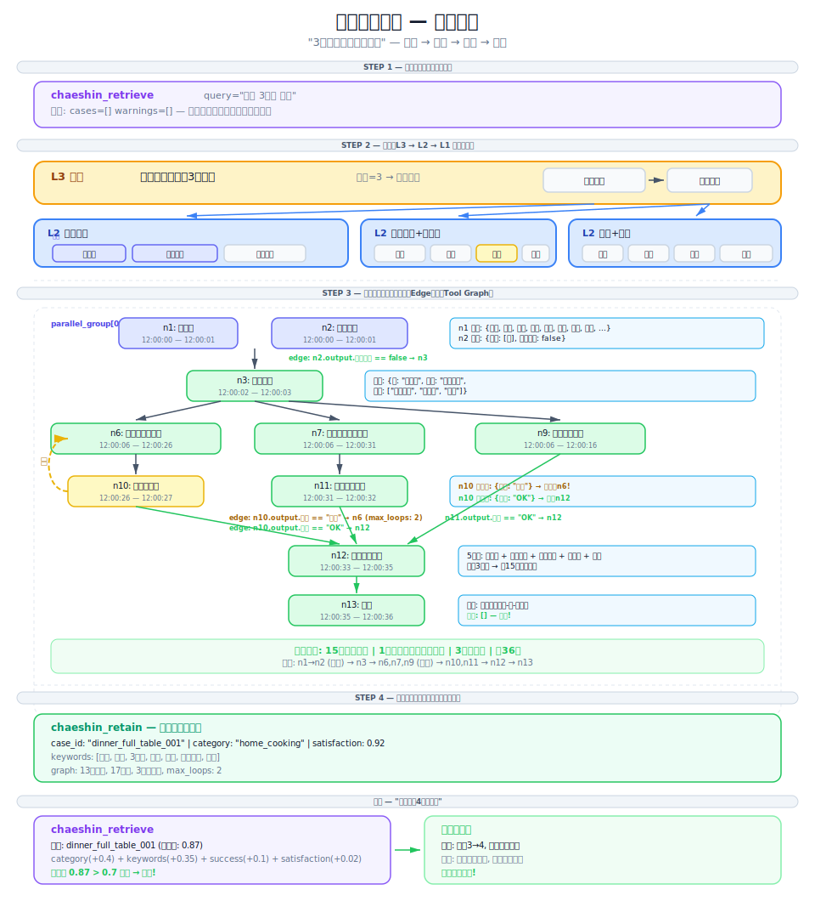
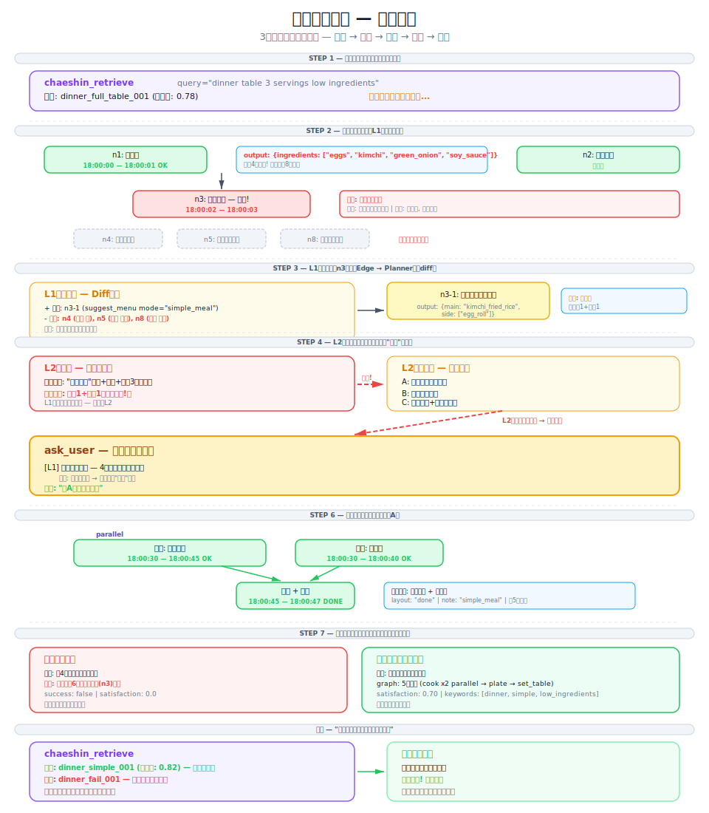

# Chaeshin (採薪)

**能记住有效方案的LLM代理。** 採薪不再每次即兴调用工具，而是存储成功的执行模式并复用——让你的代理随着每次任务不断进步。

<p align="center">
  
</p>

[English](../../README.md) | [한국어](../ko/README.md) | [日本語](../ja/README.md) | [Español](../es/README.md) | [Français](../fr/README.md) | [Deutsch](../de/README.md)

---

## 问题所在

大多数LLM代理要么**即兴**进行工具调用，要么遵循**硬编码**的流水线：

- **即兴型**（ReAct风格）：跳过步骤、顺序错误、反复犯同样的错误。
- **硬编码型**：每个新场景都需要修改代码。无法扩展。

## 解决方案

採薪记住有效的方案。当类似请求到来时，它检索经过验证的工具执行图，进行适配，执行，并保存结果。这就是[Case-Based Reasoning](https://en.wikipedia.org/wiki/Case-based_reasoning)：**检索 → 复用 → 修订 → 保留。**

失败的案例也会被保存——同样的错误不会再犯第二次。

```
第1天：  代理从零开始即兴处理所有任务
第7天：  保存了20个案例——常见模式被复用
第30天： 100+个案例——代理几乎不再即兴，遵循经过验证的模式
```

---

## 快速开始

### 1. 安装

```bash
pip install chaeshin
```

### 2. 连接到你的代理

```bash
chaeshin setup claude-code       # Claude Code (MCP + 自动学习)
chaeshin setup claude-desktop    # Claude Desktop
chaeshin setup openclaw          # OpenClaw
```

就是这样。Claude现在会自动：
- **执行**多步骤任务之前 → 检索过去的模式
- **完成**任务之后 → 保存执行图
- **失败**时 → 保存失败模式，避免重复

<details>
<summary>其他安装方式</summary>

使用 [uv](https://docs.astral.sh/uv/)（推荐）：

```bash
uv pip install chaeshin
```

使用 `uvx`（无需全局安装）：

```bash
uvx chaeshin setup claude-code --uvx
```

手动MCP配置（添加到 `~/.claude.json`）：

```json
{
  "mcpServers": {
    "chaeshin": {
      "command": "uv",
      "args": ["tool", "run", "chaeshin-mcp"]
    }
  }
}
```
</details>

<details>
<summary>作为独立库使用（任意代理）</summary>

```python
from chaeshin import CaseStore, ProblemFeatures

store = CaseStore()
store.load_json(open("cases.json").read())

results = store.retrieve(ProblemFeatures(request="send daily PR summary to slack"))
if results:
    graph = results[0][0].solution.tool_graph
```
</details>

### 3. 试试演示

```bash
git clone https://github.com/GEOHYEON/chaeshin.git && cd chaeshin
uv sync --all-extras
uv run python -m examples.cooking.chef_agent   # 无需API密钥
```

<details>
<summary>LLM + VectorDB 演示（OpenAI + ChromaDB）</summary>

```bash
cp .env.example .env         # 填入你的 OPENAI_API_KEY
uv run python -m examples.cooking.chef_agent_llm
```
</details>

<details>
<summary>Web UI 演示（Gradio）</summary>

```bash
cp .env.example .env
uv run python -m examples.cooking.app
```
</details>

完整指南请参阅[快速开始文档](docs/quickstart.md)。

---

## 工作原理

### 工具图

工具调用以**图结构**表示——不是简单的列表。节点是工具调用；边定义顺序和条件。支持循环（例如，"品尝 → 太淡 → 继续煮 → 再次品尝"）。

<p align="center">
  
</p>

### 不可变图 + 可变上下文

图在执行过程中不会改变。只有**执行上下文**（游标、节点状态、输出）会更新。当出现意外情况且没有匹配的边时，LLM通过最小化的**diff**修改图——而非完全重新生成。

### 当出现意外情况

实际执行并不总是按计划进行。採薪通过**基于diff的重规划**来处理：

<p align="center">
  
</p>

---

## 完整示例——摆设餐桌

一个完整的演示："为3人准备晚餐，其中一个孩子对虾过敏。"展示每个步骤——检索、分层分解、并行烹饪、品尝检查循环和失败升级。

<p align="center">
  
</p>

<p align="center">
  
</p>

完整场景及逐步说明：
[English](../../examples/dinner-table/scenario_en.md) ·
[한국어](../../examples/dinner-table/scenario_ko.md) ·
[日本語](../../examples/dinner-table/scenario_ja.md) ·
[中文](../../examples/dinner-table/scenario_zh.md)

---

## 集成

所有平台共享 `~/.chaeshin/cases.json`——在Claude Code中保存的案例可以在OpenClaw中使用，反之亦然。

<p align="center">
  
</p>

| 平台 | 命令 | 功能 |
|------|------|------|
| Claude Code | `chaeshin setup claude-code` | MCP服务器 + 自动学习规则（`CLAUDE.md`） |
| Claude Desktop | `chaeshin setup claude-desktop` | 自动编辑 `claude_desktop_config.json` |
| OpenClaw | `chaeshin setup openclaw` | 将 `SKILL.md` 安装到工作区 |

设置后可用的三个工具：

| 工具 | 说明 |
|------|------|
| `chaeshin_retrieve` | 搜索过去的案例——分别返回成功和失败案例 |
| `chaeshin_retain` | 保存执行图（成功和失败均保存） |
| `chaeshin_stats` | 查看案例库统计信息 |

---

## 监控——可视化图编辑器

<p align="center">
  
</p>

基于Next.js和React Flow构建的Web工具图编辑器。拖放节点、绘制边、设置条件，从 `~/.chaeshin/cases.json` 导入/导出案例。

```bash
cd chaeshin-monitor && pnpm install && pnpm dev
```

---

## 架构

<p align="center">
  
</p>

<details>
<summary>项目结构</summary>

```
chaeshin/
├── schema.py               # 核心数据类型 (Case, ToolGraph, GraphNode, GraphEdge)
├── case_store.py           # CBR 4R循环: 检索、复用、修订、保留
├── graph_executor.py       # 工具图执行器（并行、循环、条件）
├── planner.py              # 基于LLM的图创建 / 适配 / 重规划（基于diff）
├── cli/                    # chaeshin setup claude-code / claude-desktop / openclaw
├── integrations/
│   ├── claude_code/        # MCP服务器 (FastMCP) + CLAUDE.md自动学习模板
│   ├── openclaw/           # SKILL.md + 桥接CLI
│   ├── openai.py           # LLM + 嵌入适配器
│   ├── chroma.py           # ChromaDB向量案例存储
│   └── chaebi.py           # Chaebi市场同步
└── agents/                 # 编排器、分解器、执行器、反思
chaeshin-monitor/           # Next.js Web UI
examples/cooking/           # 演示代理（泡菜汤、大酱汤、恢复场景）
examples/dinner-table/      # 完整演示（4种语言）
```
</details>

## 系统要求

- Python 3.10+
- 核心功能无需额外依赖
- 可选：`openai`（LLM适配器）、`chromadb`（向量存储）、`httpx`（Chaebi市场）

## 相关研究

採薪从以下研究中获得了启发：

- [CBR for LLM Agents (2025)](https://arxiv.org/abs/2504.06943) — CBR + LLM集成综述
- [DS-Agent (ICML 2024)](https://arxiv.org/abs/2402.17453) — 基于CBR的数据科学代理
- [Voyager (NeurIPS 2023)](https://arxiv.org/abs/2305.16291) — 基于技能库的经验驱动学习
- [GAP (2025)](https://arxiv.org/html/2510.25320v1) — 基于图的工具并行执行
- [HTN Plan Repair (2025)](https://arxiv.org/abs/2504.16209) — 层次化计划修复

**有何不同？** 採薪将工具图作为CBR案例存储，使用支持循环的一般图（而非仅DAG），采用基于diff的修改而非完全重新生成，并结合代码处理正常流程而LLM仅在异常情况下介入的混合执行方式。

## 许可证

MIT——参见 [LICENSE](../../LICENSE)

---

*敎子採薪——不要给木柴，要教会如何采薪。*
