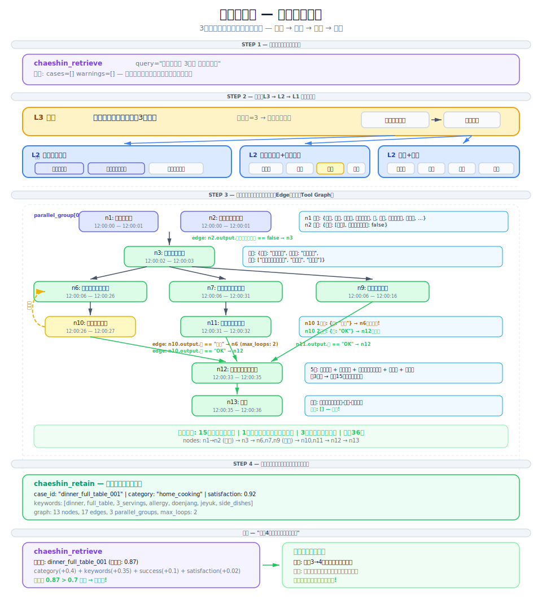
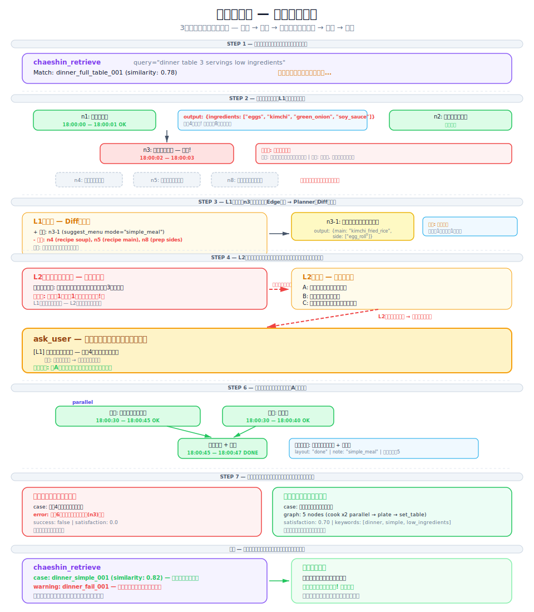

# 夕食の献立を整える — 詳細シナリオ (日本語)

> Chaeshinの CBR (Case-Based Reasoning) エンジンの動作を、**夕食の献立を整える**という日常的な例で完全に理解するためのウォークスルーです。
> 成功シナリオと失敗シナリオの両方を含みます。

## ダイアグラム

<p align="center">
  
</p>
<p align="center"><em>成功: 検索 → 分解 → 実行（並列＋ループ）→ 保存</em></p>

<p align="center">
  
</p>
<p align="center"><em>失敗: Retrieve → Fail → L1 Replan → L2 エスカレーション → ユーザー → リカバリー → Retain</em></p>

---

## 目次

1. [背景: ツール定義](#1-背景-ツール定義)
2. [シナリオ A: 成功ケース — 最初から最後まで](#2-シナリオ-a-成功ケース)
3. [シナリオ B: 失敗ケース — エスカレーションとリカバリー](#3-シナリオ-b-失敗ケース)
4. [2つのシナリオの比較](#4-2つのシナリオの比較)

---

## 1. 背景: ツール定義

「夕食の献立」エージェントが使用できるツール一覧です。

| ツール名 | 説明 | 入力例 | 出力例 |
|----------|------|--------|--------|
| `冷蔵庫確認` | 冷蔵庫内の食材リスト取得 | `{}` | `{食材: ["豚肉","豆腐","白菜キムチ","卵","ほうれん草",...]}` |
| `アレルギー確認` | 家族のアレルギー確認 | `{家族: ["母","父","子供"]}` | `{結果: {子供: ["エビ"]}}` |
| `メニュー提案` | 食材+人数+制約からメニュー推薦 | `{食材: [...], 人数: 3, 除外: ["エビ"]}` | `{メニュー: {汁物: "味噌チゲ", メイン: "豚の生姜焼き", 副菜: ["ほうれん草ナムル","卵焼き","キムチ"]}}` |
| `レシピ検索` | 特定メニューのレシピ取得 | `{メニュー: "豚の生姜焼き"}` | `{手順: [...], 所要時間: "25分", 難易度: "中"}` |
| `下ごしらえ` | 食材の洗い・切り・下茹で | `{食材: "ほうれん草", 方法: "茹でる"}` | `{状態: "完了", 所要時間: "5分"}` |
| `調理` | 実際の料理(炒め/煮込み/焼きなど) | `{メニュー: "豚の生姜焼き", 工程: "炒め", 火力: "強火"}` | `{状態: "完了", 味: "OK"}` |
| `味見` | 味の確認・調整 | `{メニュー: "味噌チゲ", チェック: ["塩味","旨味"]}` | `{味: "OK"}` または `{味: "薄い", 提案: "塩を追加"}` |
| `盛り付け` | 器に盛って配膳準備 | `{メニュー一覧: [...], 人数: 3}` | `{状態: "完了"}` |
| `配膳` | テーブルに全メニューを配置 | `{メニュー一覧: [...], 人数: 3}` | `{配置: "完了", 不足: []}` |
| `タイマー設定` | 調理タイマー | `{時間: "20分", 対象: "味噌チゲ"}` | `{状態: "タイマー開始"}` |

---

## 2. シナリオ A: 成功ケース

### ユーザーリクエスト

```
「今夜の夕食を用意して。3人分で、子供がエビアレルギーだよ。」
```

---

### STEP 1: Retrieve（過去ケース検索）

エージェントがまず行うのは、**過去に似たリクエストがあったかどうか**の検索です。

```python
chaeshin_retrieve(
    query="夕食の献立 3人分 アレルギーあり",
    category="家庭料理",
    keywords="夕食,献立,3人分,アレルギー,家庭料理"
)
```

**検索結果:**

```
cases: []           # 初めてなのでマッチするケースなし
warnings: []        # 失敗履歴もなし
```

> **判断:** マッチなし → 新規グラフを生成

---

### STEP 2: Decompose（階層分解）

Chaeshin v2は複雑なリクエストを **3つのレイヤーに分解**します。

```
L3 (戦略): 「夕食の献立を整える」
│
├── L2 (パターン): 「メニュー決定」
│   ├── L1 (実行): 冷蔵庫確認
│   ├── L1 (実行): アレルギー確認
│   └── L1 (実行): メニュー提案
│
├── L2 (パターン): 「汁物の調理」
│   ├── L1 (実行): レシピ検索 → 下ごしらえ → 調理 → 味見
│   └── L1 (実行): タイマー設定
│
├── L2 (パターン): 「メイン料理の調理」
│   ├── L1 (実行): レシピ検索 → 下ごしらえ → 調理
│   └── L1 (実行): 味見
│
├── L2 (パターン): 「副菜の準備」
│   ├── L1 (実行): 下ごしらえ(ほうれん草) → 調理(ナムル)
│   ├── L1 (実行): 下ごしらえ(卵) → 調理(卵焼き)
│   └── L1 (実行): 盛り付け(キムチ) ← 既存の副菜
│
└── L2 (パターン): 「配膳」
    └── L1 (実行): 盛り付け(全品) → 配膳
```

**難易度計算:** `depth = 3` → difficulty = 3（Chaeshinトリガー条件 `difficulty >= 2` を満たす）

---

### STEP 3: Tool Graph 生成

```
                    ┌──────────────┐
              ┌─────┤ n1: 冷蔵庫確認├─────┐
              │     └──────────────┘     │
              │                           │    並列実行
              │     ┌────────────────┐    │
              └─────┤ n2: アレルギー確認├──┘
                    └───────┬────────┘
                            │
                    ┌───────▼────────┐
                    │ n3: メニュー提案 │
                    └───────┬────────┘
                            │
          ┌─────────────────┼─────────────────┐
          │                 │                 │
   ┌──────▼───────┐ ┌──────▼───────┐ ┌───────▼──────┐
   │n4: レシピ検索 │ │n5: レシピ検索 │ │n8: 下ごしらえ │
   │  (味噌チゲ)   │ │  (生姜焼き)   │ │  (副菜)      │
   └──────┬───────┘ └──────┬───────┘ └───────┬──────┘
          │                 │                 │
   ┌──────▼──────┐  ┌──────▼──────┐  ┌───────▼──────┐
   │ n6: 調理    │  │ n7: 調理    │  │ n9: 調理     │   並列調理
   │ (味噌チゲ)   │  │ (生姜焼き)   │  │(ナムル+卵焼き)│
   └──────┬──────┘  └──────┬──────┘  └───────┬──────┘
          │                 │                 │
   ┌──────▼──────┐  ┌──────▼──────┐          │
   │ n10: 味見   │  │ n11: 味見   │          │
   └──────┬──────┘  └──────┬──────┘          │
          │                 │                 │
          └────────┬────────┴─────────────────┘
                   │
          ┌────────▼────────┐
          │  n12: 盛り付け   │
          └────────┬────────┘
                   │
          ┌────────▼────────┐
          │   n13: 配膳     │
          └─────────────────┘
```

---

### STEP 4: Execute — レイヤー別実行ログ

#### Layer 1: 食材確認 + アレルギーチェック（並列）

```
[12:00:00] ▶ n1: 冷蔵庫確認 — 開始
[12:00:00] ▶ n2: アレルギー確認 — 開始（並列）
[12:00:01] ✅ n1: 完了
           出力: {食材: ["豚肉","豆腐","白菜キムチ","ほうれん草","卵","味噌","じゃがいも","玉ねぎ","長ネギ","唐辛子粉","ごま油"]}
[12:00:01] ✅ n2: 完了
           出力: {結果: {子供: ["エビ"]}, 重篤アレルギー: false}
```

> **Edge評価:** `n2.output.重篤アレルギー == false` → n3へ進行

#### Layer 1: メニュー決定

```
[12:00:02] ▶ n3: メニュー提案 — 開始
[12:00:03] ✅ n3: 完了
           出力: {メニュー: {汁物: "味噌チゲ", メイン: "豚の生姜焼き", 副菜: ["ほうれん草ナムル","卵焼き","キムチ"]}}
```

#### Layer 2: レシピ検索 + 下ごしらえ（並列）

```
[12:00:03] ▶ n4: レシピ検索(味噌チゲ) — 開始
[12:00:03] ▶ n5: レシピ検索(生姜焼き) — 開始（並列）
[12:00:03] ▶ n8: 下ごしらえ(副菜) — 開始（並列）
[12:00:04] ✅ n4: 完了 → {手順: ["出汁をとる","味噌を溶く","野菜を入れる","煮込む"], 所要時間: "20分"}
[12:00:04] ✅ n5: 完了 → {手順: ["タレ作り","漬け込み","焼く"], 所要時間: "25分"}
[12:00:06] ✅ n8: 完了 → {ほうれん草: "茹で完了", 卵: "溶き完了"}
```

#### Layer 2: メイン調理（並列）

```
[12:00:06] ▶ n6: 調理(味噌チゲ) — 開始
[12:00:06] ▶ n7: 調理(生姜焼き) — 開始（並列）
[12:00:06] ▶ n9: 調理(副菜) — 開始（並列）
[12:00:26] ✅ n6: 完了 → {味状態: "確認必要"}
[12:00:31] ✅ n7: 完了 → {味状態: "確認必要"}
[12:00:16] ✅ n9: 完了 → {ほうれん草ナムル: "OK", 卵焼き: "OK"}
```

#### Layer 2: 味見

```
[12:00:26] ▶ n10: 味見(味噌チゲ) — 開始
[12:00:27] ✅ n10: 完了 → {味: "薄い", 提案: "味噌を大さじ1追加"}
```

> **Edge評価:** `n10.output.味 == 薄い` → **ループ発動！n6に戻る**（loop_count: 1）

```
[12:00:27] 🔄 ループ: n10 → n6（味が薄い→再調理）
[12:00:27] ▶ n6: 調理(味噌チゲ) — 再開始（味噌追加後5分煮込み）
[12:00:32] ✅ n6: 完了
[12:00:32] ▶ n10: 味見 — 再開始
[12:00:33] ✅ n10: 完了 → {味: "OK"}
```

```
[12:00:31] ▶ n11: 味見(生姜焼き) — 開始
[12:00:32] ✅ n11: 完了 → {味: "OK"}
```

#### Layer 3: 盛り付け + 配膳

```
[12:00:33] ▶ n12: 盛り付け — 開始
[12:00:35] ✅ n12: 完了 → {状態: "全品盛り付け完了"}

[12:00:35] ▶ n13: 配膳 — 開始
[12:00:36] ✅ n13: 完了 → {配置: "完了", 不足: []}
```

---

### STEP 5: Retain（保存）

```python
chaeshin_retain(
    request="夕食の献立 3人分 アレルギー対応",
    category="家庭料理",
    keywords="夕食,献立,3人分,アレルギー,味噌チゲ,生姜焼き,副菜",
    graph={"nodes": [...], "edges": [...]},
    satisfaction=0.92,
    summary="夕食（味噌チゲ+生姜焼き+副菜3品）3人分完了。味噌チゲで味見ループ1回発動。"
)
```

---

## 3. シナリオ B: 失敗ケース

### ユーザーリクエスト

```
「今夜の夕食を用意して。3人分だけど、冷蔵庫にあんまりないと思う。」
```

---

### STEP 1: Retrieve

```python
chaeshin_retrieve(
    query="夕食の献立 3人分 食材不足",
    category="家庭料理",
    keywords="夕食,献立,食材不足"
)
```

**結果:** （シナリオAの成功ケースが保存済みと仮定）

```
cases: [{case_id: "dinner_full_table_001", similarity: 0.78}]
warnings: []
```

---

### STEP 2: Adapt + 実行開始

#### Layer 1: 冷蔵庫確認

```
[18:00:00] ▶ n1: 冷蔵庫確認 — 開始
[18:00:01] ✅ n1: 完了
           出力: {食材: ["卵", "キムチ", "長ネギ", "醤油"]}   ← 食材がとても少ない！
```

#### Layer 1: メニュー提案 — 最初の失敗

```
[18:00:02] ▶ n3: メニュー提案 — 開始
[18:00:03] ❌ n3: メニュー提案 — 失敗！
           出力: {エラー: "献立構成不可", 理由: "汁物・メイン料理の食材不足",
                  可能メニュー: ["卵焼き","キムチチャーハン"]}
```

---

### STEP 3: L1 Replan（第1回再計画）

```
[18:00:03] 🔧 Replanトリガー: n3で予想外の出力、マッチするEdgeなし
```

```json
{
  "reasoning": "食材4種では献立の構成は不可能。簡単な食事にダウングレード。",
  "added_nodes": [
    {"id": "n3-1", "tool": "メニュー提案", "params_hint": {"モード": "簡単食"}, "note": "簡単食で再提案"}
  ],
  "removed_nodes": ["n4", "n5", "n8"]
}
```

```
[18:00:04] ▶ n3-1: メニュー提案(簡単食) — 開始
[18:00:05] ✅ n3-1: 完了
           出力: {メニュー: {メイン: "キムチチャーハン", 副菜: ["卵焼き"]}, 警告: "汁物なし"}
```

---

### STEP 4: L2 エスカレーション — 「献立ではない」

```
[18:00:05] ⚠️ L2チェックポイント: ユーザーは「夕食の献立」をリクエストしたが、
           現在の計画はメイン1品+副菜1品のみ。
           「献立」= 汁物 + メイン + 副菜3品以上が一般的。
           → 要件を満たしていない。

[18:00:05] 📤 エスカレーション: L1 → L2
           理由:「献立の要件未達（汁物なし、副菜不足）」
```

L2が選択肢を生成:

```json
{
  "options": [
    "A: 現在の食材で簡単食（献立ではない）",
    "B: 買い物に行ってから献立を整える",
    "C: 汁物はデリバリー + 残りは自炊"
  ]
}
```

> **L2でも解決不可** → **ユーザーに確認**

---

### STEP 5: ユーザーフィードバック

```
エージェント:「冷蔵庫には卵、キムチ、長ネギ、醤油しかなくて、献立は難しいです。
             選択肢は3つあります：
             A) キムチチャーハン+卵焼きでシンプルに
             B) 買い物に行ってから献立を整える
             C) 汁物はデリバリーで注文+残りは自炊
             どうしますか？」

ユーザー:「Aでいいよ。シンプルに食べよう。」
```

---

### STEP 6: 縮小グラフの実行

```
[18:00:30] ▶ n7-new: 調理(キムチチャーハン) — 開始
[18:00:45] ✅ n7-new: 完了 → {味: "OK"}

[18:00:30] ▶ n9-new: 調理(卵焼き) — 開始（並列）
[18:00:40] ✅ n9-new: 完了 → {味: "OK"}

[18:00:45] ▶ n12: 盛り付け — 完了
[18:00:46] ▶ n13: 配膳 — 完了 → {備考: "簡単食"}
```

---

### STEP 7: Retain（失敗+成功の両方を保存）

#### 失敗パターン保存（アンチパターン）

```python
chaeshin_retain(
    request="食材4種で献立グラフを適用",
    category="家庭料理",
    keywords="夕食,献立,食材不足,失敗",
    success=False,
    error_reason="食材4種では献立の構成は不可。メニュー提案(n3)で失敗。食材が6種未満の場合は献立グラフを適用しないこと。"
)
```

#### 縮小成功パターン保存

```python
chaeshin_retain(
    request="食材不足時に簡単食へ切り替え",
    category="家庭料理",
    keywords="夕食,簡単食,食材不足,キムチチャーハン",
    graph={...},
    satisfaction=0.70,
    summary="献立リクエストだったが食材不足で簡単食に切り替え。ユーザー承認。"
)
```

---

### 次回の類似リクエスト

```
ユーザー:「今夜ご飯作って。冷蔵庫にあまりないけど。」
```

```
cases: [{case_id: "dinner_simple_001", similarity: 0.82}]
warnings: [{case_id: "dinner_fail_001", advice: "食材不足時に献立グラフを適用しないこと"}]
```

> **判断:** 簡単食グラフを最初から使用 → エスカレーションなしで一発完了！

---

## 4. 2つのシナリオの比較

| 項目 | シナリオ A（成功） | シナリオ B（失敗→リカバリー） |
|------|-------------------|---------------------------|
| **リクエスト** | 夕食の献立 3人分 | 夕食の献立 3人分（食材不足） |
| **Retrieve** | マッチなし（初回） | 既存ケースマッチ（0.78） |
| **実行ノード** | 13個（全部） | 13個 → 失敗 → 5個に縮小 |
| **ループ** | 味見1回（味噌チゲ） | なし |
| **エスカレーション** | なし | L1→L2→ユーザー |
| **最終結果** | 献立（汁物+メイン+副菜3品） | 簡単食（チャーハン+卵焼き） |
| **満足度** | 0.92 | 0.70 |
| **保存** | 成功ケース1件 | 失敗警告1件 + 簡単食成功1件 |
| **学習効果** | 次の献立リクエストで再利用 | 食材不足時に献立を無理に試行しない |

---

## 重要ポイント

1. **Retrieve First**: 必ず過去ケースを先に検索。類似度 > 0.7 なら再利用。
2. **レイヤー分解**: 複雑なリクエストは L3→L2→L1 に分割。各レイヤーで独立実行。
3. **Edge Condition**: ノードの出力が次の経路を決定。`味 == 薄い` → ループ、`味 == OK` → 次へ。
4. **エスカレーション**: L1失敗 → L1再計画 → L2 → ユーザー。段階的にエスカレート。
5. **アンチパターン**: 失敗も保存し、同じ間違いを繰り返さない。
6. **並列実行**: 独立したタスクは並列で処理（冷蔵庫確認+アレルギー確認、汁物+メイン+副菜の同時調理）。
