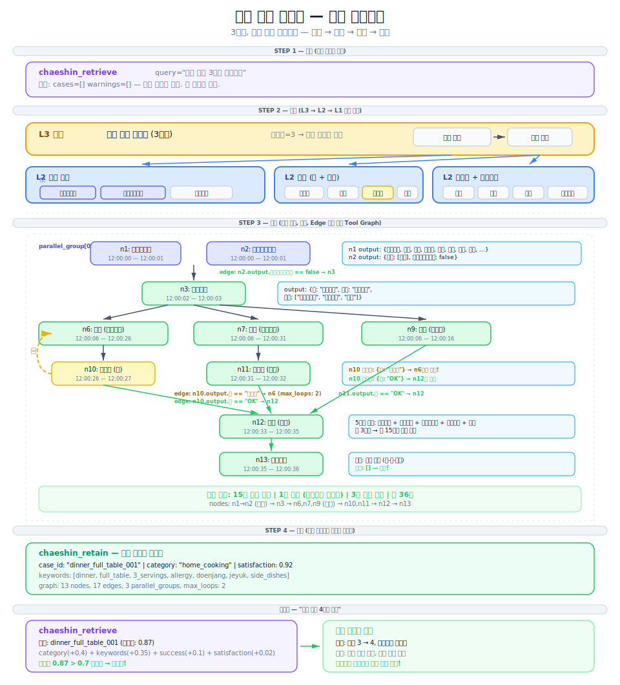
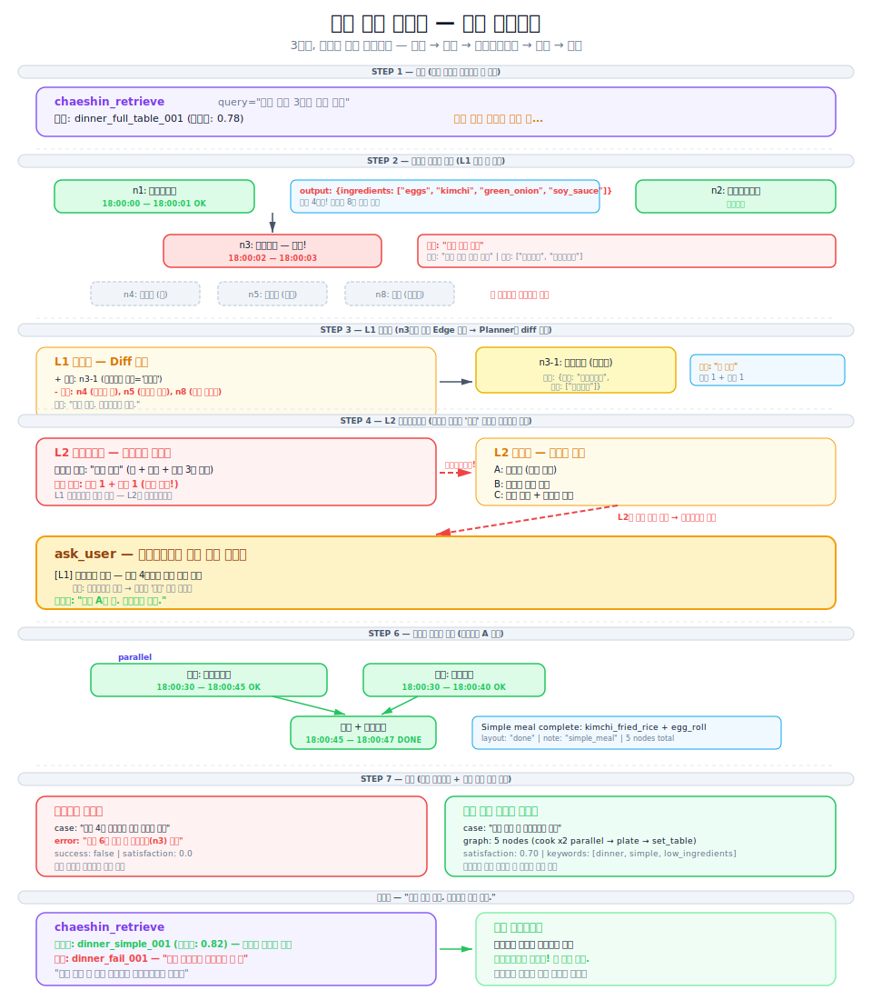

# 저녁 한상 차리기 - 상세 시나리오 (한국어)

> Chaeshin의 CBR(Case-Based Reasoning) 동작을 **저녁 한상 차리기**라는 일상적인 예시로 완전히 이해할 수 있는 워크스루입니다.
> 성공 시나리오와 실패 시나리오 모두 포함되어 있습니다.

## 다이어그램

<p align="center">
  
</p>
<p align="center"><em>성공 시나리오: 검색 → 분해 → 실행 (병렬+루프) → 저장</em></p>

<p align="center">
  
</p>
<p align="center"><em>실패 시나리오: Retrieve → Fail → L1 Replan → L2 Escalation → User → Recover → Retain</em></p>

---

## 목차

1. [배경: 도구(Tool) 정의](#1-배경-도구tool-정의)
2. [시나리오 A: 성공 케이스 — 처음부터 끝까지](#2-시나리오-a-성공-케이스)
3. [시나리오 B: 실패 케이스 — 에스컬레이션과 복구](#3-시나리오-b-실패-케이스)
4. [두 시나리오 비교](#4-두-시나리오-비교)

---

## 1. 배경: 도구(Tool) 정의

"저녁 한상 차리기" 에이전트가 사용할 수 있는 도구들입니다.

| 도구명 | 설명 | 입력 예시 | 출력 예시 |
|--------|------|-----------|-----------|
| `냉장고확인` | 냉장고에 있는 재료 목록 반환 | `{}` | `{재료: ["돼지고기", "두부", "묵은지", "계란", "시금치", ...]}` |
| `알레르기체크` | 식구 알레르기 확인 | `{식구: ["엄마","아빠","아이"]}` | `{결과: {아이: ["새우"]}}` |
| `메뉴추천` | 재료+인원+제약조건으로 메뉴 추천 | `{재료: [...], 인원: 3, 제외: ["새우"]}` | `{메뉴: {국: "된장찌개", 메인: "제육볶음", 반찬: ["시금치나물","계란말이","김치"]}}` |
| `레시피검색` | 특정 메뉴의 레시피 반환 | `{메뉴: "제육볶음"}` | `{단계: [...], 시간: "25분", 난이도: "중"}` |
| `재료손질` | 재료 씻기/썰기/다듬기 | `{재료: "시금치", 방법: "데치기"}` | `{상태: "완료", 소요시간: "5분"}` |
| `조리` | 실제 요리 (볶기/끓이기/굽기 등) | `{메뉴: "제육볶음", 단계: "볶기", 불세기: "센불"}` | `{상태: "완료", 맛상태: "OK"}` |
| `간보기` | 맛 확인 및 조절 | `{메뉴: "된장찌개", 체크: ["짠맛","감칠맛"]}` | `{맛: "OK"}` 또는 `{맛: "싱거움", 추천: "소금 추가"}` |
| `담기` | 그릇에 담아 상에 올리기 | `{메뉴: "제육볶음", 인분: 3, 그릇: "큰접시"}` | `{상태: "완료"}` |
| `상차리기` | 전체 메뉴를 식탁에 배치 | `{메뉴목록: [...], 인원: 3}` | `{배치: "완료", 누락: []}` |
| `타이머설정` | 조리 타이머 | `{시간: "20분", 대상: "된장찌개"}` | `{상태: "타이머시작"}` |

---

## 2. 시나리오 A: 성공 케이스

### 사용자 요청

```
"오늘 저녁 한상 차려줘. 3인분이고, 아이가 새우 알레르기 있어."
```

---

### STEP 1: Retrieve (검색)

에이전트가 가장 먼저 하는 일은 **과거에 비슷한 요청이 있었는지** 검색하는 것입니다.

```python
chaeshin_retrieve(
    query="저녁 한상 차리기 3인분 알레르기 있음",
    category="가정식",
    keywords="저녁,한상,3인분,알레르기,가정식"
)
```

**검색 결과:**

```
cases: []           # 처음이라 매칭되는 케이스 없음
warnings: []        # 실패 이력도 없음
```

> **판단:** 매칭 케이스 없음 → 새로 그래프를 생성해야 함

---

### STEP 2: Decompose (계층 분해)

Chaeshin v2는 복잡한 요청을 **3개 레이어로 분해**합니다.

```
L3 (전략): "저녁 한상 차리기"
│
├── L2 (패턴): "메뉴 결정"
│   ├── L1 (실행): 냉장고확인
│   ├── L1 (실행): 알레르기체크
│   └── L1 (실행): 메뉴추천
│
├── L2 (패턴): "국/찌개 조리"
│   ├── L1 (실행): 레시피검색 → 재료손질 → 조리 → 간보기
│   └── L1 (실행): 타이머설정
│
├── L2 (패턴): "메인 반찬 조리"
│   ├── L1 (실행): 레시피검색 → 재료손질 → 조리
│   └── L1 (실행): 간보기
│
├── L2 (패턴): "밑반찬 준비"
│   ├── L1 (실행): 재료손질(시금치) → 조리(나물무침)
│   ├── L1 (실행): 재료손질(계란) → 조리(계란말이)
│   └── L1 (실행): 담기(김치)  ← 이미 있는 반찬
│
└── L2 (패턴): "상 차리기"
    └── L1 (실행): 담기(각 메뉴) → 상차리기
```

**난이도 계산:** `depth = 3` → difficulty = 3 (Chaeshin 트리거 조건 `difficulty >= 2` 충족)

---

### STEP 3: Tool Graph 생성

분해된 계층을 바탕으로 실행 가능한 Tool Graph가 만들어집니다.

```
                    ┌─────────────┐
              ┌─────┤ n1: 냉장고확인 ├─────┐
              │     └─────────────┘     │
              │                          │      병렬 실행
              │     ┌──────────────┐     │      (parallel_group)
              └─────┤ n2: 알레르기체크├─────┘
                    └──────┬───────┘
                           │
                    ┌──────▼───────┐
                    │ n3: 메뉴추천   │
                    └──────┬───────┘
                           │
          ┌────────────────┼────────────────┐
          │                │                │
   ┌──────▼──────┐  ┌─────▼──────┐  ┌──────▼──────┐
   │n4: 레시피검색│  │n5: 레시피검색│  │n8: 재료손질  │
   │  (된장찌개)  │  │  (제육볶음)  │  │  (밑반찬들)  │
   └──────┬──────┘  └─────┬──────┘  └──────┬──────┘
          │                │                │
   ┌──────▼──────┐  ┌─────▼──────┐  ┌──────▼──────┐    병렬 조리
   │n6: 조리     │  │n7: 조리     │  │n9: 조리      │    (parallel_group)
   │ (된장찌개)   │  │ (제육볶음)   │  │(나물+계란말이)│
   └──────┬──────┘  └─────┬──────┘  └──────┬──────┘
          │                │                │
   ┌──────▼──────┐  ┌─────▼──────┐         │
   │n10: 간보기   │  │n11: 간보기  │         │
   └──────┬──────┘  └─────┬──────┘         │
          │                │                │
          │   ┌────────────┼────────────────┘
          │   │            │
          ▼   ▼            ▼
   ┌──────────────────────────┐
   │   n12: 담기 (전체 메뉴)    │
   └────────────┬─────────────┘
                │
   ┌────────────▼─────────────┐
   │   n13: 상차리기 (3인분)    │
   └──────────────────────────┘
```

**JSON 표현:**

```json
{
  "nodes": [
    {"id": "n1",  "tool": "냉장고확인",   "params_hint": {},                                              "note": "현재 재료 파악"},
    {"id": "n2",  "tool": "알레르기체크", "params_hint": {"식구": ["엄마","아빠","아이"]},                   "note": "알레르기 확인"},
    {"id": "n3",  "tool": "메뉴추천",     "params_hint": {"인원": 3},                                     "note": "메뉴 결정"},
    {"id": "n4",  "tool": "레시피검색",   "params_hint": {"메뉴": "된장찌개"},                              "note": "국 레시피"},
    {"id": "n5",  "tool": "레시피검색",   "params_hint": {"메뉴": "제육볶음"},                              "note": "메인 레시피"},
    {"id": "n6",  "tool": "조리",         "params_hint": {"메뉴": "된장찌개", "단계": "전체"},              "note": "국 조리"},
    {"id": "n7",  "tool": "조리",         "params_hint": {"메뉴": "제육볶음", "단계": "전체"},              "note": "메인 조리"},
    {"id": "n8",  "tool": "재료손질",     "params_hint": {"재료": ["시금치","계란"], "방법": "데치기/풀기"}, "note": "밑반찬 손질"},
    {"id": "n9",  "tool": "조리",         "params_hint": {"메뉴": ["시금치나물","계란말이"]},               "note": "밑반찬 조리"},
    {"id": "n10", "tool": "간보기",       "params_hint": {"메뉴": "된장찌개"},                              "note": "국 간 확인"},
    {"id": "n11", "tool": "간보기",       "params_hint": {"메뉴": "제육볶음"},                              "note": "메인 간 확인"},
    {"id": "n12", "tool": "담기",         "params_hint": {"메뉴목록": ["된장찌개","제육볶음","시금치나물","계란말이","김치"], "인분": 3}, "note": "그릇에 담기"},
    {"id": "n13", "tool": "상차리기",     "params_hint": {"인원": 3},                                      "note": "식탁 배치"}
  ],
  "edges": [
    {"from_node": "n1", "to_node": "n3"},
    {"from_node": "n2", "to_node": "n3", "condition": "n2.output.심각한알레르기 == false"},
    {"from_node": "n2", "to_node": null,  "condition": "n2.output.심각한알레르기 == true", "action": "ask_user", "note": "심각한 알레르기 발견 시 사용자 확인"},
    {"from_node": "n3", "to_node": "n4"},
    {"from_node": "n3", "to_node": "n5"},
    {"from_node": "n3", "to_node": "n8"},
    {"from_node": "n4", "to_node": "n6"},
    {"from_node": "n5", "to_node": "n7"},
    {"from_node": "n8", "to_node": "n9"},
    {"from_node": "n6", "to_node": "n10"},
    {"from_node": "n7", "to_node": "n11"},
    {"from_node": "n10", "to_node": "n6",  "condition": "n10.output.맛 == 싱거움", "note": "루프: 간 부족 → 재조리"},
    {"from_node": "n10", "to_node": "n12", "condition": "n10.output.맛 == OK"},
    {"from_node": "n11", "to_node": "n7",  "condition": "n11.output.맛 == 싱거움", "note": "루프: 간 부족 → 재조리"},
    {"from_node": "n11", "to_node": "n12", "condition": "n11.output.맛 == OK"},
    {"from_node": "n9",  "to_node": "n12"},
    {"from_node": "n12", "to_node": "n13"}
  ],
  "parallel_groups": [["n1","n2"], ["n4","n5","n8"], ["n6","n7","n9"]],
  "entry_nodes": ["n1", "n2"],
  "max_loops": 2
}
```

---

### STEP 4: Execute (실행) — 레이어별 상세 로그

#### Layer 1 실행: 재료 파악 + 알레르기 체크 (병렬)

```
[12:00:00] ▶ n1: 냉장고확인 — 시작
[12:00:00] ▶ n2: 알레르기체크 — 시작 (병렬)
[12:00:01] ✅ n1: 냉장고확인 — 완료
           출력: {재료: ["돼지고기","두부","묵은지","시금치","계란","된장","감자","양파","대파","고춧가루","참기름"]}
[12:00:01] ✅ n2: 알레르기체크 — 완료
           출력: {결과: {아이: ["새우"]}, 심각한알레르기: false}
```

> **Edge 평가:** `n2.output.심각한알레르기 == false` → n3으로 진행

#### Layer 1 실행: 메뉴 결정

```
[12:00:02] ▶ n3: 메뉴추천 — 시작
           입력: {재료: ["돼지고기","두부",...], 인원: 3, 제외: ["새우"]}
[12:00:03] ✅ n3: 메뉴추천 — 완료
           출력: {메뉴: {국: "된장찌개", 메인: "제육볶음", 반찬: ["시금치나물","계란말이","김치"]}}
```

> **Edge 평가:** n3 완료 → n4, n5, n8 동시 시작 (병렬)

#### Layer 2 실행: 레시피 검색 + 손질 (병렬)

```
[12:00:03] ▶ n4: 레시피검색(된장찌개) — 시작
[12:00:03] ▶ n5: 레시피검색(제육볶음) — 시작 (병렬)
[12:00:03] ▶ n8: 재료손질(밑반찬) — 시작 (병렬)
[12:00:04] ✅ n4: 완료 → {단계: ["육수내기","된장풀기","채소넣기","끓이기"], 시간: "20분"}
[12:00:04] ✅ n5: 완료 → {단계: ["양념장만들기","재우기","볶기"], 시간: "25분"}
[12:00:06] ✅ n8: 완료 → {시금치: "데침완료", 계란: "풀기완료"}
```

#### Layer 2 실행: 본격 조리 (병렬)

```
[12:00:06] ▶ n6: 조리(된장찌개) — 시작
[12:00:06] ▶ n7: 조리(제육볶음) — 시작 (병렬)
[12:00:06] ▶ n9: 조리(밑반찬) — 시작 (병렬)
[12:00:26] ✅ n6: 조리(된장찌개) — 완료 → {맛상태: "확인필요"}
[12:00:31] ✅ n7: 조리(제육볶음) — 완료 → {맛상태: "확인필요"}
[12:00:16] ✅ n9: 조리(밑반찬) — 완료 → {시금치나물: "OK", 계란말이: "OK"}
```

#### Layer 2 실행: 간보기

```
[12:00:26] ▶ n10: 간보기(된장찌개) — 시작
[12:00:27] ✅ n10: 완료 → {맛: "싱거움", 추천: "된장 1스푼 추가"}
```

> **Edge 평가:** `n10.output.맛 == 싱거움` → **루프 발동! n6으로 돌아감** (loop_count: 1)

```
[12:00:27] 🔄 루프: n10 → n6 (간 부족, 재조리)
[12:00:27] ▶ n6: 조리(된장찌개) — 재시작 (된장 추가 후 5분 더 끓이기)
[12:00:32] ✅ n6: 완료
[12:00:32] ▶ n10: 간보기(된장찌개) — 재시작
[12:00:33] ✅ n10: 완료 → {맛: "OK"}
```

> **Edge 평가:** `n10.output.맛 == OK` → n12로 진행

```
[12:00:31] ▶ n11: 간보기(제육볶음) — 시작
[12:00:32] ✅ n11: 완료 → {맛: "OK"}
```

> **Edge 평가:** `n11.output.맛 == OK` → n12로 진행

#### Layer 3 실행: 담기 + 상차리기

```
[12:00:33] ▶ n12: 담기 — 시작
           입력: {메뉴목록: ["된장찌개","제육볶음","시금치나물","계란말이","김치"], 인분: 3}
[12:00:35] ✅ n12: 완료 → {상태: "전체담기완료"}

[12:00:35] ▶ n13: 상차리기 — 시작
           입력: {인원: 3, 배치: "한식기본(밥-국-반찬)"}
[12:00:36] ✅ n13: 완료 → {배치: "완료", 누락: []}
```

---

### STEP 5: Retain (저장)

실행 성공 → CBR 케이스로 저장합니다.

```python
chaeshin_retain(
    request="저녁 한상 차리기 3인분 알레르기 대응",
    category="가정식",
    keywords="저녁,한상,3인분,알레르기,된장찌개,제육볶음,밑반찬",
    graph={
        "nodes": [...],   # 위의 13개 노드
        "edges": [...],   # 위의 17개 엣지
    },
    satisfaction=0.92,
    summary="저녁 한상 (된장찌개+제육볶음+밑반찬3종) 3인분 완료. 된장찌개 간보기 루프 1회 발동."
)
```

**저장된 케이스:**

```json
{
  "case_id": "dinner_full_table_001",
  "problem_features": {
    "request": "저녁 한상 차리기 3인분 알레르기 대응",
    "category": "가정식",
    "keywords": ["저녁", "한상", "3인분", "알레르기", "된장찌개", "제육볶음"],
    "constraints": ["새우 알레르기"],
    "context": {"servings": 3, "allergy": ["새우"]}
  },
  "outcome": {
    "success": true,
    "tools_executed": 15,
    "loops_triggered": 1,
    "total_time_ms": 36000,
    "user_satisfaction": 0.92
  },
  "metadata": {
    "layer": "L3",
    "used_count": 1,
    "avg_satisfaction": 0.92,
    "tags": ["한식", "가정식", "저녁", "한상", "알레르기대응"]
  }
}
```

---

### 다음에 비슷한 요청이 오면?

```
사용자: "오늘 저녁 한상 차려줘. 4인분."
```

```python
chaeshin_retrieve(query="저녁 한상 차리기 4인분", keywords="저녁,한상,가정식")
```

**검색 결과:**

```
cases: [
  {
    case_id: "dinner_full_table_001",
    similarity: 0.87,         # 카테고리 일치(+0.4) + 키워드 겹침(+0.35) + 성공보너스(+0.1)
    problem: "저녁 한상 차리기 3인분 알레르기 대응"
  }
]
```

> **판단:** similarity 0.87 > 0.7 → **기존 그래프를 적응(Adapt)하여 재사용!**
>
> 변경점: `인분: 3 → 4`, 알레르기 조건 재확인만 하면 됨. 전체 그래프를 처음부터 만들 필요 없음.

---

## 3. 시나리오 B: 실패 케이스

### 사용자 요청

```
"오늘 저녁 한상 차려줘. 3인분인데 냉장고에 별로 없을 거야."
```

---

### STEP 1: Retrieve (검색)

```python
chaeshin_retrieve(
    query="저녁 한상 차리기 3인분 재료부족",
    category="가정식",
    keywords="저녁,한상,재료부족"
)
```

**검색 결과:** (시나리오 A의 성공 케이스가 저장되어 있다고 가정)

```
cases: [
  {case_id: "dinner_full_table_001", similarity: 0.78}
]
warnings: []
```

> **판단:** 기존 케이스 발견 → Adapt해서 사용

---

### STEP 2: Adapt (적응) + 실행 시작

기존 그래프를 가져와 인분만 조정 후 실행 시작.

#### Layer 1: 냉장고 확인

```
[18:00:00] ▶ n1: 냉장고확인 — 시작
[18:00:01] ✅ n1: 완료
           출력: {재료: ["계란", "김치", "대파", "간장"]}   ← 재료가 매우 적음!
```

```
[18:00:01] ▶ n2: 알레르기체크 — 완료 (문제없음)
```

#### Layer 1: 메뉴 추천 — 첫 번째 실패

```
[18:00:02] ▶ n3: 메뉴추천 — 시작
           입력: {재료: ["계란","김치","대파","간장"], 인원: 3}
[18:00:03] ❌ n3: 메뉴추천 — 실패!
           출력: {에러: "한상 구성 불가", 이유: "국/찌개 재료 부족, 메인반찬 재료 부족", 가능메뉴: ["계란말이","김치볶음밥"]}
```

> **문제:** `메뉴추천`이 "한상"을 차릴 수 없다고 반환.
> 기존 그래프에서는 `n3 → n4,n5,n8`로 진행하는데, 에러 출력이므로 **매칭되는 Edge가 없음**.

---

### STEP 3: L1 Replan (1차 재계획)

```
[18:00:03] 🔧 Replan 트리거: n3에서 예상 밖 출력, 매칭 Edge 없음
```

Planner가 Diff 기반 수정안을 생성합니다:

```json
{
  "reasoning": "한상 전체가 불가하므로 가능한 메뉴(계란말이, 김치볶음밥)로 축소",
  "added_nodes": [
    {"id": "n3-1", "tool": "메뉴추천", "params_hint": {"모드": "간단식", "재료": ["계란","김치","대파","간장"]}, "note": "간단식으로 재추천"}
  ],
  "removed_nodes": ["n4", "n5", "n8"],
  "added_edges": [
    {"from_node": "n3", "to_node": "n3-1", "condition": "n3.output.에러 != null"}
  ],
  "removed_edges": [
    {"from_node": "n3", "to_node": "n4"},
    {"from_node": "n3", "to_node": "n5"},
    {"from_node": "n3", "to_node": "n8"}
  ]
}
```

#### L1 Replan 실행

```
[18:00:04] ▶ n3-1: 메뉴추천(간단식) — 시작
[18:00:05] ✅ n3-1: 완료
           출력: {메뉴: {메인: "김치볶음밥", 반찬: ["계란말이"]}, 경고: "국/찌개 없음"}
```

---

### STEP 4: L2 에스컬레이션 — "한상"이 아닌데?

에이전트가 체크포인트에서 확인:

```
[18:00:05] ⚠️ L2 체크포인트: 사용자가 "한상"을 요청했으나 현재 계획은 메인1+반찬1
           "한상" = 국 + 메인 + 반찬 3종 이상이 일반적
           현재 계획은 요청을 충족하지 못함
```

> **L1 replan으로 해결 불가** → **L2로 에스컬레이션**

```
[18:00:05] 📤 에스컬레이션: L1 → L2
           이유: "한상 구성 요건 미충족 (국 없음, 반찬 부족)"
```

L2 Replan 시도:

```json
{
  "reasoning": "재료가 절대적으로 부족. 장보기를 추가하거나 사용자에게 선택지 제시 필요",
  "options": [
    "A: 현재 재료로 간단식 (한상 아님)",
    "B: 장보기 추가 후 한상",
    "C: 배달 음식 일부 + 집밥 조합"
  ]
}
```

> **L2도 자체 해결 불가** → **사용자에게 문의**

---

### STEP 5: 사용자 피드백

```
에이전트: "냉장고에 계란, 김치, 대파, 간장만 있어서 한상은 어려워요.
          세 가지 옵션이 있어요:
          A) 김치볶음밥 + 계란말이로 간단하게
          B) 마트에서 장보고 와서 한상
          C) 국은 배달시키고 나머지 집밥
          어떻게 할까요?"

사용자: "아 그냥 A로 해. 간단하게 먹자."
```

---

### STEP 6: 축소된 그래프 실행

```
[18:00:30] ▶ n7-new: 조리(김치볶음밥) — 시작
[18:00:45] ✅ n7-new: 완료 → {맛상태: "OK"}

[18:00:30] ▶ n9-new: 조리(계란말이) — 시작 (병렬)
[18:00:40] ✅ n9-new: 완료 → {맛상태: "OK"}

[18:00:45] ▶ n12: 담기 — 시작
[18:00:46] ✅ n12: 완료

[18:00:46] ▶ n13: 상차리기 — 시작
[18:00:47] ✅ n13: 완료 → {배치: "완료", 비고: "간단식"}
```

---

### STEP 7: Retain (실패 + 성공 모두 저장)

#### 실패 패턴 저장 (Anti-pattern)

```python
chaeshin_retain(
    request="저녁 한상 차리기 3인분 재료부족 상태에서 한상 그래프 적용",
    category="가정식",
    keywords="저녁,한상,재료부족,실패,에스컬레이션",
    success=False,
    error_reason="재료 4종으로는 한상(국+메인+반찬3) 구성 불가. 기존 한상 그래프를 재료 부족 상황에 적용하면 n3에서 실패함.",
    satisfaction=0.0
)
```

#### 축소 성공 패턴 저장

```python
chaeshin_retain(
    request="재료 부족 시 간단식으로 전환 (김치볶음밥+계란말이)",
    category="가정식",
    keywords="저녁,간단식,재료부족,김치볶음밥,계란말이",
    graph={...},  # 축소된 그래프
    satisfaction=0.70,
    summary="한상 요청이었으나 재료 부족으로 간단식 전환. 사용자 수락."
)
```

---

### 다음에 비슷한 요청이 오면?

```
사용자: "오늘 저녁 해줘. 냉장고에 별거 없어."
```

```python
chaeshin_retrieve(query="저녁 재료부족", keywords="저녁,재료부족")
```

**검색 결과:**

```
cases: [
  {case_id: "dinner_simple_001", similarity: 0.82, problem: "재료 부족 시 간단식 전환"}
]
warnings: [
  {case_id: "dinner_fail_001", error: "재료 4종으로 한상 그래프 적용 → n3 실패",
   advice: "재료 부족 시 한상 그래프를 그대로 적용하지 말 것"}
]
```

> **판단:**
> - 성공 케이스: 간단식 그래프 사용
> - 경고: 한상 그래프를 재료 부족에 적용하면 안 됨 (과거 실패)
> - → 처음부터 간단식 그래프로 시작. 에스컬레이션 없이 한 번에 완료!

---

## 4. 두 시나리오 비교

| 항목 | 시나리오 A (성공) | 시나리오 B (실패→복구) |
|------|-------------------|----------------------|
| **요청** | 저녁 한상 3인분 | 저녁 한상 3인분 (재료 부족) |
| **Retrieve** | 매칭 없음 (첫 실행) | 기존 한상 케이스 매칭 (0.78) |
| **Decompose** | L3→L2→L1 정상 분해 | 기존 그래프 Adapt |
| **실행 노드** | 13개 | 13개 → 실패 → 5개로 축소 |
| **루프** | 간보기 1회 (된장찌개) | 없음 |
| **에스컬레이션** | 없음 | L1→L2→사용자 |
| **최종 결과** | 한상 (국+메인+반찬3) | 간단식 (볶음밥+계란말이) |
| **만족도** | 0.92 | 0.70 |
| **저장** | 성공 케이스 1개 | 실패 경고 1개 + 간단식 성공 1개 |
| **학습 효과** | 다음 한상 요청 시 재사용 | 재료 부족 시 한상 시도 방지 |

---

## 핵심 포인트

1. **Retrieve First**: 항상 과거 케이스를 먼저 검색. 비슷한 경험이 있으면 재사용.
2. **Layer 분해**: 복잡한 요청은 L3→L2→L1으로 쪼갬. 각 레이어에서 독립적으로 실행.
3. **Edge Condition**: 각 노드의 출력이 다음 경로를 결정. `맛 == 싱거움`이면 루프, `맛 == OK`면 다음으로.
4. **에스컬레이션**: L1에서 해결 안 되면 L2로, L2도 안 되면 사용자에게. 단계적으로 올라감.
5. **Anti-pattern**: 실패도 저장하여 같은 실수를 반복하지 않음.
6. **병렬 실행**: 독립적인 작업(냉장고확인+알레르기체크, 국+메인+밑반찬 동시 조리)은 병렬로 처리.
