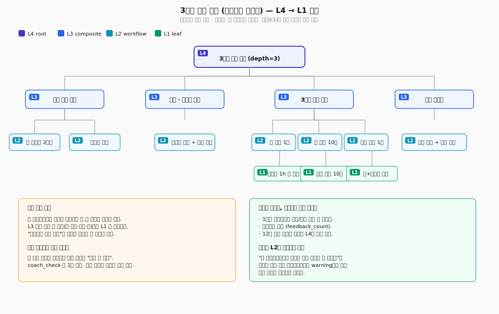
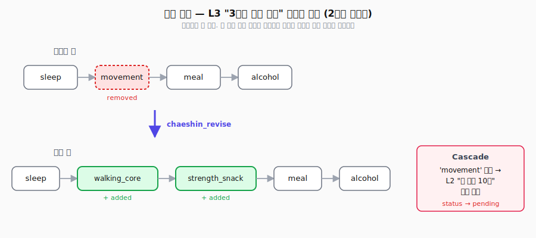

# 생활습관 코칭 — 만성피로 직장인 3개월 리셋

> Chaeshin을 **비의료 생활습관 코칭**에 적용한 예시. 코치가 클라이언트의 얘기를
> 듣고 플랜을 짜고, 주간 피드백을 받아가며 플랜이 바뀌는 과정을 다룬다.

**왜 이 예시인가.** 생활습관은 "했다/안 했다"가 바로 성공/실패가 아니다. 시도는
했는데 결과가 애매하고, 몇 주 지나봐야 뭐가 먹혔는지 보인다. 플랜을 중간에
뜯어고치는 일도 잦다. 이 도메인은 Chaeshin의 세 가지 설계를 그대로 필요로 한다.

1. **단계별로 계속 쪼개기** — "몸 좀 챙기자"는 추상적인 목표가 "양치할 때 스쿼트
   10번"까지 내려간다. 중간 단계를 건너뛰면 실행이 안 된다.
2. **성공도 실패도 아닌 '아직'** — 주간 체크인에서 "해봤는데 애매해요"가
   기본이다. 억지로 성공/실패로 찍지 않는다.
3. **위에서 플랜을 고치면 아래에 자동으로 영향** — 2주차에 운동 계획을 통째로
   바꿨을 때, 기존에 잡아놓은 세부 습관 중 뭐가 무효가 됐는지 놓치지 않는다.

---

## 목차

1. [클라이언트 프로필](#1-클라이언트-프로필)
2. [쓸 수 있는 도구들](#2-쓸-수-있는-도구들)
3. [전체 케이스 트리 — L4에서 L1까지](#3-전체-케이스-트리--l4에서-l1까지)
4. [시나리오 A — 12주 성공 경로](#4-시나리오-a--12주-성공-경로)
5. [시나리오 B — 연락이 끊겼을 때](#5-시나리오-b--연락이-끊겼을-때)
6. [시나리오 C — 번아웃 신호, 플랜 자체가 틀렸던 경우](#6-시나리오-c--번아웃-신호-플랜-자체가-틀렸던-경우)
7. [2주차에 플랜을 뜯어고치면 — 연쇄 반응](#7-2주차에-플랜을-뜯어고치면--연쇄-반응)
8. [비슷한 클라이언트가 다시 왔을 때](#8-비슷한-클라이언트가-다시-왔을-때)

---

## 1. 클라이언트 프로필

```
박OO (34, 남)
"올해는 진짜 몸 좀 챙기고 싶어요. 만성피로가 너무 심해요."
```

| 항목 | 값 | 어떻게 알았는지 |
|------|------|-----------|
| 직업 | 스타트업 PM, 주 60-70시간 | 첫 상담 |
| 잠 | 새벽 2-3시에 자고 8시에 일어남. 주말에 10시간 몰아서 잠 | 수면 앱 2주치 데이터 |
| 운동 | 최근 6개월 0회 | 본인 얘기 |
| 식사 | 아침 거르고, 점심 배달, 저녁은 야근 도시락 아니면 회식 | 3일치 식사 사진 |
| 술 | 주 3-4회. 절반은 업무 관련 | 본인 얘기 |
| 스트레스 | 본인 평가 8/10, PHQ-2는 2점 (임상 수준은 아님) | 간이 설문 |
| 전에 했던 시도 | 헬스장 3개월 끊었다가 1주 가고 포기, 두 번 | 첫 상담 |
| 진짜 동기 | 돌 지난 아이. "아빠가 먼저 지쳐있는 게 싫어요." | 2차 상담에서 나옴 |

**코치의 판단**. 교과서적인 "주 5회 유산소 + 정상 식사" 같은 처방은 이 사람에게
이미 두 번 실패한 방식이다. 진짜 걸림돌은 시간도 체력도 아니고 **심리적으로
여유가 없다는 것** — 번아웃 직전이다. 어떤 계획이든 "이것까지 해야 한다"로
느껴지는 순간 반발이 생긴다. 최소 부하로 시작해서 관성을 만드는 전략으로 간다.

---

## 2. 쓸 수 있는 도구들

| 도구 | 무엇을 하는가 | 입력 | 출력 |
|--------|------|------|------|
| `daily_energy_log` | 하루 끝 에너지 점수 1-5 기록 | `{client_id, level, note}` | `{logged_at}` |
| `sleep_snapshot` | 수면 앱에서 지난밤 데이터 긁어오기 | `{client_id}` | `{duration, efficiency, bedtime}` |
| `meal_snapshot` | 식사 사진 한 장 받기 (평가 X) | `{client_id, photo_ref}` | `{logged_at}` |
| `habit_checkin` | 주간 점검 — 뭐가 쉬웠고 뭐가 막혔나 | `{client_id, week}` | `{kept, skipped, notes}` |
| `walk_reminder` | "지금 10분만 걷자" 푸시 | `{client_id, time}` | `{notification_id}` |
| `content_nudge` | 짧은 글/영상 하나 추천 | `{client_id, topic}` | `{content_id}` |
| `workout_propose` | 부담 적은 운동 하나만 제안 | `{client_id, minutes, equipment}` | `{exercise, steps}` |
| `meal_rule_propose` | 한 줄짜리 식사 규칙 제안 | `{client_id, context}` | `{rule_text}` |
| `coach_check` | 코치가 비동기로 상태 확인 | `{client_id}` | `{risk_signal, note}` |
| `session_book` | 다음 코칭 세션 예약 | `{client_id, when}` | `{session_id}` |

---

## 3. 전체 케이스 트리 — L4에서 L1까지

<p align="center">
  
</p>

구조의 전체 형태는 위 다이어그램. 아래는 노드 레벨까지 펼친 상세 트리다.


```
L4  "3개월 생활 리셋"                                             [depth=3]
│   그래프: 상담 → 상황 파악 → 플랜 → 이탈 방지
│
├── L3  "상담 — 현재 패턴 파악"                                   [depth=2]
│   ├── L2  "잠 데이터 모으기"                                     [depth=1]
│   │   └── L1  수면 앱에서 2주치 자동 수집                         [리프]
│   ├── L2  "식사 패턴 사진으로 확인"                              [depth=1]
│   │   └── L1  meal_snapshot × 3일 (기록만, 평가 안 함)
│   ├── L2  "하루 에너지·기분 기록"                                [depth=1]
│   │   └── L1  daily_energy_log 2주
│   └── L2  "진짜 동기 찾기"                                       [depth=1]
│       └── L1  2차 상담 — 코치 메모
│
├── L3  "상황 파악 — 위험 신호와 현실성 체크"                       [depth=2]
│   ├── L2  "번아웃 신호 확인"                                     [depth=1]
│   │   └── L1  PHQ-2 + 스트레스 자기평가
│   ├── L2  "반복 실패 패턴 분석"                                  [depth=1]
│   │   └── L1  코치 메모 — "헬스장 = 지뢰"
│   └── L2  "최소 실행 단위 합의"                                  [depth=1]
│       └── L1  "하루 총 15분 부하로 시작" 서로 동의
│
├── L3  "3개월 플랜 구조"                                          [depth=2]
│   │   (상담 + 상황 파악 결과를 반영. 욕심 부리지 않음.)
│   ├── L2  "잠 — 자기 1시간 전 카페인·술 끊기"                   [depth=1]
│   │   ├── L1  규칙 하나만: "취침 1시간 전 카페인/술 X"
│   │   └── L1  content_nudge(topic="수면위생 3분 영상")
│   ├── L2  "몸 쓰기 — 매일 10분"                                 [depth=1]
│   │   ├── L1  workout_propose(minutes=10, equipment="none")
│   │   └── L1  walk_reminder(time="점심 직후")
│   ├── L2  "식사 규칙 하나만"                                     [depth=1]
│   │   └── L1  meal_rule_propose(context="아침 공복") → "물 한 컵 + 바나나"
│   └── L2  "술 — 주 1회 '안 마시는 날' 만들기"                    [depth=1]
│       └── L1  "매주 화요일 = 물만 마시는 날" 합의
│
└── L3  "이탈 방지망"                                             [depth=2]
    ├── L2  "주간 점검"                                            [depth=1]
    │   └── L1  habit_checkin(매주 일요일 저녁)
    ├── L2  "2주차·6주차에 플랜 다시 짜기"                         [depth=1]
    │   ├── L1  session_book(when="2주 후")
    │   └── L1  session_book(when="6주 후")
    └── L2  "조용한 안전망"                                        [depth=1]
        └── L1  coach_check(월 1회, 연락 끊기면 코치가 먼저 연락)
```

**설계에서 놓친 게 없는 포인트**

- **욕심 부리지 않기**. "3개월 플랜" 아래 네 갈래(잠·운동·식사·술)마다 딱 하나씩만
  건다. 잠은 "카페인 끊기" 하나, 운동은 "10분" 하나, 식사는 한 줄짜리 규칙 하나.
  이걸 초과하면 실패 확률이 확 올라간다는 게 이 클라이언트 이력에서 이미
  드러났다.
- **실패 이력을 데이터로**. "헬스장 등록 → 1주 가고 포기" 패턴은 "반복 실패 패턴
  분석" L2에 명시적으로 저장한다. 앞으로 이 클라이언트의 retrieve에서 "헬스장
  기반 플랜"은 경고로 뜬다.
- **이탈 방지망을 따로 레이어로**. 앱 기반 코칭이 실패하는 대표 지점이 바로
  "이탈 후 복귀"다. `coach_check`가 월 1회 자동으로 돌면서 연락이 끊기면 코치가
  먼저 연락하는 패턴을 그래프에 박아둔다.

---

## 4. 시나리오 A — 12주 성공 경로

### T0 — 첫 상담 당일

1. 코치가 `chaeshin_retrieve(query="30대 직장인 만성피로 리셋", keywords="번아웃,반복실패,스타트업")` 호출.
   - 비슷한 케이스 하나, 유사도 0.76. "과부하로 설계한 리셋 플랜이 실패한 케이스"가
     경고로 뜬다. 교훈을 읽고 반영.

2. `chaeshin_decompose(query=..., tools="sleep_snapshot,workout_propose,...")` 로
   분해 가이드를 받음.

3. 코치(또는 호스트 AI)가 위 트리 전체를 단계별로 저장. **전부 "아직 판단 안 함"
   상태**로 들어간다.
   - L4 루트: `wait_mode="deadline"`, `deadline_seconds=12*7*24*3600`
   - L3 "플랜": `deadline_seconds=2*7*24*3600` — 2주 뒤 첫 점검 시점이
     마일스톤

### T+1주 — 첫 점검

- 클라이언트: "점심 걷기 4번 했어요. 카페인은 한 번 실수. 10분 운동은 3번."
- 코치 해석: **아직 성공/실패 판단 안 한다**. 1주는 시작일 뿐이다.
- `chaeshin_feedback(case_id=<L2 "몸 쓰기 — 매일 10분">, feedback="점심 걷기는
  자연스러움. 10분 운동은 '저녁에 하려다 까먹음' 패턴", feedback_type="modify")`
- 해당 L2의 feedback_count +1. 상태는 **여전히 pending**.

### T+2주 — 플랜 다시 짜는 세션 (자세한 건 §7)

§7에서 자세히 다룬다. 10분 홈운동이 안 붙는다는 걸 인정하고 L3 "플랜" 그래프를
손본다.

### T+6주 — 중간 세션

- 잠 평균 5.5h → 6.5h. 점심 걷기 주 5회 유지.
- 여전히 HbA1c 같은 단일 지표는 없다. 코치는 여러 신호를 종합적으로 본다.
- 아직 성공 판정은 안 내린다. 12주 시점에 가서 전체를 한 번에 본다.

### T+12주 — 마지막 세션

- 클라이언트 자기 평가: 에너지 3→4. 아침에 알람 없이 일어나는 날이 주 3회.
- 배우자 말: "주말에 애랑 더 잘 놀아요."
- 코치가 `chaeshin_verdict(case_id=<L4 루트>, status="success",
  note="지속 가능한 습관 세 개 정착. 잠 1시간 늘어남. 본인 말: '다음 단계
  가보고 싶어요.'")`
- 이 판정은 L4에만 success로 들어간다. 자식 L3/L2/L1 중 **실제로 유지된 것만**
  코치가 개별적으로 success로 찍는다. "술 — 주 1회 안 마시는 날"은 8주차에
  포기했으니 `verdict=failure, note="회식 주도권이 없어서 어려움. 다른 접근
  필요"`로 실패 기록을 남긴다.

실패를 굳이 남기는 이유: 나중에 비슷한 클라이언트가 올 때 "이 사람들에겐 이
규칙이 안 먹혔다"는 신호가 자연스럽게 경고로 올라오게 하려고.

---

## 5. 시나리오 B — 연락이 끊겼을 때

4주차부터 주간 점검 무응답. 세션 노쇼.

- 6주차에 `coach_check`가 자동으로 돌면서 코치가 먼저 연락. 답 없음.
- 12주 데드라인이 지나도 상태는 **여전히 pending**.
  - 이게 핵심. 코치는 "답 없으니 실패"라고 임의로 찍지 않는다. "잠수"라는
    이유만으로 실패 라벨을 붙이면, 나중에 비슷한 클라이언트에게 엉뚱한 경고가
    뜰 수 있다.
- `chaeshin_stats.overdue_pending` 카운트가 +1. 모니터 `/hierarchy`에서 pending
  배지가 진한 호박색(데드라인 지남)으로 바뀐다.
- 코치의 월간 리뷰 루틴: 데드라인 지난 pending 목록을 훑고 연락 시도 / 종결
  결정. 최종적으로 `chaeshin_verdict(status="failure", note="3회 연락 시도
  무응답. 종결 처리")` 를 직접 기록한다.

**"답 없음"은 실패가 아니다.** 이걸 자동화하지 않는 게 의도된 설계다.

---

## 6. 시나리오 C — 번아웃 신호, 플랜 자체가 틀렸던 경우

가상의 다른 경로. 코치가 비슷한 케이스 조회를 건너뛰고 표준 플랜을 그대로 씀:

- L3 "플랜"에 **주 4회 홈 HIIT + 주 1회 헬스장**을 집어넣음. (이 사람이 과거
  실패한 바로 그 패턴이다.)
- 2주차 점검에서 "하나도 못 했어요. 일 끝나면 아무것도 할 힘이 없어요."
- 코치가 L3 플랜에 대해 `chaeshin_verdict(status="failure", note="번아웃 직전
  클라이언트에게 주 5회 운동은 비현실. 최소 부하 원칙 위반")`
- 이 L3는 앞으로 retrieve에서 경고로 뜬다. 다음에 번아웃 신호가 있는
  클라이언트가 오면 같은 실수를 반복하지 않는다.

---

## 7. 2주차에 플랜을 뜯어고치면 — 연쇄 반응

**2주차 세션에 들어온 점검 데이터**:
- "10분 홈운동"은 3주 합쳐 2번 했다. 자꾸 저녁으로 미루다 까먹음.
- "점심 걷기"는 주 5회. 이건 자연스럽게 되고 있다.
- "카페인 끊기"는 주 4일 지킴.

코치의 진단: 홈운동 자리를 잘못 잡았다. 걷기는 잘 붙었으니, 그걸 중심으로 돌리고
근력은 다른 자리에 끼워넣자. **플랜(L3)의 구조 자체를 손본다** — 단순히 피드백
남기는 걸로는 부족하다:

<p align="center">
  
</p>


```python
chaeshin_revise(
    case_id=L3_plan_id,
    graph={
        "nodes": [
            {"id": "sleep", "tool": "compose"},
            {"id": "walking_core", "tool": "compose",
             "note": "점심 걷기 유지 + 20분으로 늘리기"},
            {"id": "strength_snack", "tool": "compose",
             "note": "양치할 때 스쿼트 10번 — 일상에 끼워넣기"},
            {"id": "meal", "tool": "compose"},
            {"id": "alcohol", "tool": "compose"},
        ],
        "edges": [
            {"from": "sleep", "to": "walking_core"},
            {"from": "walking_core", "to": "strength_snack"},
            {"from": "strength_snack", "to": "meal"},
            {"from": "meal", "to": "alcohol"},
        ],
    },
    reason="홈운동이 안 붙음. 잘 되고 있는 걷기를 중심으로 옮기고, 의지 없이도 되는 근력(양치+스쿼트)으로 재배치",
    cascade=True,
)
```

응답으로 돌아오는 것:
```json
{
  "added_nodes": ["walking_core", "strength_snack"],
  "removed_nodes": ["movement"],
  "retained_nodes": ["sleep", "meal", "alcohol"],
  "orphaned_children": ["<L2 '몸 쓰기 — 매일 10분' case_id>"]
}
```

이때 자동으로 벌어지는 일:

1. **L2 "몸 쓰기 — 매일 10분"의 연결이 끊긴다**. 이 L2가 붙어있던
   `parent_node_id="movement"` 노드가 새 그래프에서 사라졌기 때문.
   - 상태가 pending으로 돌아간다. `feedback_log`에 이렇게 찍힌다:
     `[cascade] parent node 'movement' removed by revise; needs review`
   - 모니터 `/hierarchy`에서 이 케이스에 빨간 `orphan` 배지가 붙어서 눈에 띈다.
   - 코치는 이걸 보고 선택: (a) 내용을 걷기 쪽으로 수정해서 `walking_core`에
     다시 붙인다, (b) 기록 의미로 남겨두고 failure로 찍는다, (c) 지운다.
     이 클라이언트에겐 (b)를 고른다 — "10분 홈운동은 이 사람에겐 안 먹힌다"는
     실패 신호가 앞으로 retrieve 경고에 뜨게 하려고.

2. **새로 생긴 `walking_core`, `strength_snack` 노드**는 "아직 안 펼쳐진
   자리"로 돌아온다.
   - 코치가 각각 아래에 새 L2 케이스를 붙인다:
     - `L2 "점심 걷기 20분으로 늘리기"` (parent_node_id="walking_core")
     - `L2 "양치할 때 스쿼트 10번"` (parent_node_id="strength_snack")

3. **유지된 `sleep`, `meal`, `alcohol`**은 건드리지 않는다. 되고 있는 건
   그대로 둔다.

4. 이벤트 로그에 `revise` 이벤트가 남는다 → 3개월 뒤 회고할 때 "2주차의 이
   수정이 전환점이었다"고 되짚을 수 있다.

**이게 코칭에서 중요한 이유**. 수정이 무한히 쌓이지 않는다. 위에서 내려오는
구조적 수정이 있으면 아래에 있던 습관 중에 뭐가 의미를 잃었는지 자동으로
"검토 필요"로 표시된다. 코치는 직접 지울지 말지 정하므로 기록은 잃지 않는다.
클라이언트 한 명의 과정이 그대로 자산으로 남는다.

---

## 8. 비슷한 클라이언트가 다시 왔을 때

6개월 뒤, 31세 여성 스타트업 마케터. 야근, 운동 안 한 지 오래, 번아웃 근접.
박OO와 비슷한 프로필.

```python
result = chaeshin_retrieve(
    query="30대 스타트업 만성피로 생활 리셋",
    keywords="번아웃,야근,반복실패",
    include_children=True,
    top_k=2,
)
```

돌아오는 결과:
- `successes[0]`: 박OO의 L4 트리, 유사도 0.79
  - `include_children=True`라서 아래가 다 펼쳐진다: "점심 걷기 → 20분으로
    늘리기"가 L2로, "양치할 때 스쿼트"가 L1로.
- `warnings`:
  - "주 5회 HIIT 플랜" L3 (시나리오 C에서 실패로 기록된 것) — 같은 실수 방지
  - "10분 홈운동" L2 (§7에서 failure로 닫은 것) — 다른 방식 필요하다는 신호

코치는 박OO 플랜을 기본으로 놓고, 이 클라이언트의 개인 제약(새벽 미팅,
자가용 없음, 반려견 있음)에 맞게 diff로 덮어쓴다:

```python
# 점심 걷기 대신 저녁 반려견 산책을 중심으로
chaeshin_update(
    case_id=<새 클라이언트의 걷기 L2>,
    patch={
        "problem_features": {"constraints": ["저녁 반려견 산책 30분 고정"]},
    },
)
```

**데이터가 자산이 되는 방식**. 박OO의 12주는 그의 3개월로 끝나지 않는다.
실패로 닫은 L2까지 포함해서 다음 클라이언트의 출발점이 된다. 코치 한 사람의
경험이 팀 전체의 검증된 패턴으로 쌓인다.

---

## 맺음말

이 시나리오에 의학 용어가 단 한 마디도 필요 없었다. Chaeshin의 세 가지 설계
결정이 생활습관 코칭이라는 **일반 도메인에서도 그대로 살아있다**.

1. **계속 쪼개는 구조** — "리셋"이라는 추상적 목표가 "양치할 때 스쿼트 10번"까지
   내려온다. 중간 단계를 생략하면 실행이 안 된다.
2. **"아직 판단 안 함"이 기본값** — "해봤어요, 애매해요"가 디폴트. 성공/실패는
   사람이 명시한다.
3. **위에서 고치면 아래가 반응한다** — 2주차에 운동 구조를 통째로 바꿔도 잘
   되고 있던 잠·식사 습관은 건드리지 않는다. 영향받는 것만 자동으로 "검토
   필요"로 뜬다.

의료 예시에서 이 패턴이 "실수 비용이 높다"는 이유로 선택됐다면, 생활습관
코칭에선 "지속 가능성 자체가 성공 지표"라서 선택된다. 이유가 다를 뿐 같은
구조가 두 도메인에 다 맞는다.

---

## 부록 — 실행해보기

두 종류가 있다:

**1. 스크립트 데모** — API 키 없이 그냥 돈다. 결정적 출력.

```bash
uv run python -m examples.lifestyle_coaching.demo
```

무엇을 보여주는가:
1. 박OO 프로필로 L4부터 L1까지 트리를 pending으로 저장
2. 1주차에 피드백만 기록 (판정 보류)
3. 2주차에 L3 플랜 그래프 수정 → 10분 홈운동 L2가 연결 끊긴 상태가 됨
4. 연결 끊긴 L2에 failure 판정 + 12주차에 L4 success 판정
5. 비슷한 프로필의 새 클라이언트가 왔을 때 retrieve로 나오는 성공 후보 + 경고

**2. 라이브 ReAct 데모** — OpenAI 키로 실제 LLM이 돈다. [`react_demo.py`](react_demo.py).

```bash
export OPENAI_API_KEY=sk-...
uv run python -m examples.lifestyle_coaching.react_demo
```

ReAct 에이전트가 2부로 나뉜 흐름을 실제로 탄다:

1부) T0 — retrieve → sleep_snapshot 등 데이터 수집 → L4 저장 → L3 plan 저장 → L2 몸쓰기 저장 → L2 잠 저장
2부) habit_checkin(week=2) → "홈운동 안 붙음" 확인 → chaeshin_revise로 L3 plan 그래프 재작성
     → 응답의 orphaned_children 에 L2_movement_id 가 나오고, 해당 L2는 pending으로 회귀
     → Final Answer에서 사용자에게 보고

저장소 결과는 temp SQLite. 영구 저장하려면 `CHAESHIN_DEMO_PERSIST=1`.
