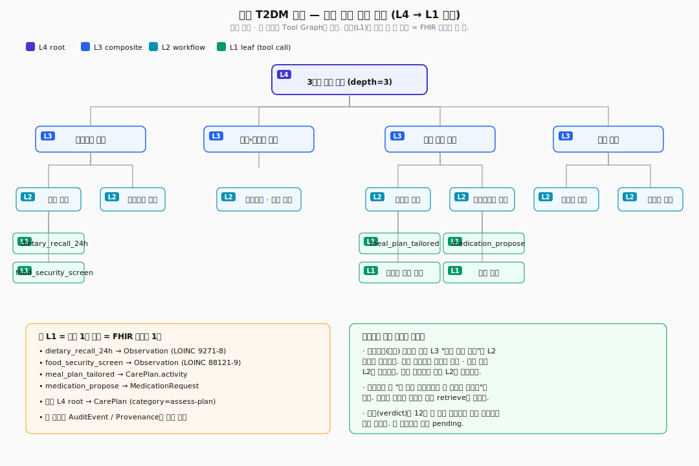
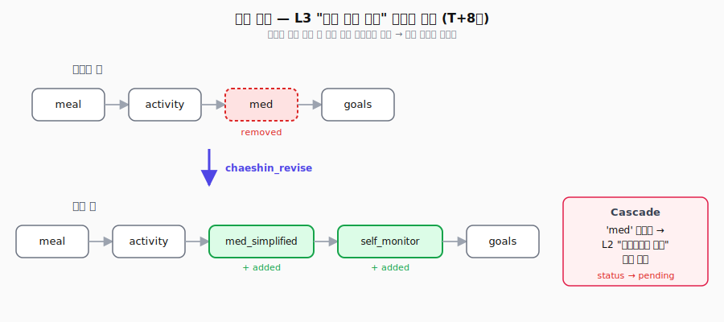

# 임상 생활습관 문진 & 맞춤 계획 — 현실 시나리오

> Chaeshin을 실제 의료 환경에서 쓸 때를 상정한 워크스루. 신규로 제2형 당뇨병
> 진단받은 환자의 초진부터 12주 추적까지 다룬다.

**왜 이 예시인가.** 의료는 결과가 몇 주에서 몇 달 뒤에 나온다. "계획을 세웠다"
그 자체로는 성공도 실패도 아니고, 결과가 나올 때까지 **아직 판단 안 함(pending)**
상태다. Chaeshin의 세 가지 상태(success / failure / pending)와 데드라인 기반의
판정 대기 설계가 이 도메인을 그대로 모델링한다.

---

## 목차

1. [환자 프로필](#1-환자-프로필)
2. [도구(Tool) 레지스트리](#2-도구tool-레지스트리--fhir-매핑-포함)
3. [전체 케이스 트리 — L4 → L1](#3-전체-케이스-트리--l4--l1)
4. [시나리오 A — 성공 경로](#4-시나리오-a--성공-경로-12주-뒤-verdict-success)
5. [시나리오 B — 중간 상태 유지 (lost to follow-up)](#5-시나리오-b--중간-상태-pending-유지)
6. [시나리오 C — 실패해서 경고 기록으로 남는 경우](#6-시나리오-c--실패해서-경고-기록으로-남는-경우)
7. [상위 플랜을 뜯어고치면 — 연쇄 반응](#7-상위-플랜을-뜯어고치면--연쇄-반응)
8. [비슷한 환자가 왔을 때 — 재사용](#8-비슷한-환자가-왔을-때--재사용)
9. [FHIR R5 리소스 매핑 부록](#9-fhir-r5-리소스-매핑-부록)

---

## 1. 환자 프로필

```
Patient: 김OO (45M, 익명)
Chief complaint: 건강검진 결과 상담 — "혈당이 높다고 나왔어요"
```

| 항목 | 값 | 출처 |
|------|------|------|
| HbA1c | 7.2% | 외부 검진 (LOINC 4548-4) |
| FBS | 142 mg/dL | 외부 검진 (LOINC 1558-6) |
| BMI | 28.4 | 측정 (LOINC 39156-5) |
| BP | 134/86 | 측정 (LOINC 85354-9) |
| 기존 진단 | 없음 (신환 T2DM) | — |
| 복용약 | 없음 | — |
| 직업 | 물류센터 야간 근무 (3교대) | 문진 |
| 가족력 | 모 T2DM, 부 AMI 58세 | 문진 |
| 흡연/음주 | 전흡연(5년 전 금연) / 주 2회 소주 1병 | 문진 |
| 경제 상황 | 외벌이, 주 70시간 근무 — "야식 아니면 편의점" | 문진 |

**이 환자의 진짜 어려운 부분**: 교과서 식단·운동 처방은 야간 3교대 + 경제적 제약에서
작동하지 않는다. 일반적인 "생활습관 교정 → 3개월 재검" 경로는 실패 확률이 높다.
Chaeshin은 이 개별성을 케이스 트리로 포착한다.

---

## 2. 도구(Tool) 레지스트리 — FHIR 매핑 포함

초진 에이전트가 호출할 수 있는 도구. 각 도구는 입력 → 출력 + 선택적으로 FHIR 리소스를 생성한다.

| 도구명 | 설명 | 입력 | 출력 (요약) | FHIR 리소스 |
|--------|------|------|-------------|-------------|
| `dietary_recall_24h` | 24시간 식이 회상 수집 | `{patient_id}` | `{meals: [...], kcal_est, macro}` | Observation (LOINC 9271-8) |
| `food_security_screen` | 식품 불안정성 스크리닝 (HFSSM 2문항) | `{patient_id}` | `{score: 0-2, insecure: bool}` | Observation (LOINC 88121-9) |
| `gpaq_activity` | GPAQ 신체활동 문진 | `{patient_id}` | `{met_minutes_week, sedentary_hours}` | Observation (LOINC 82580-1) |
| `audit_c` | AUDIT-C 알코올 스크리닝 | `{patient_id}` | `{score, risk_level}` | Observation (LOINC 75624-7) |
| `sleep_chronotype` | 수면/교대근무 평가 | `{patient_id}` | `{hours, shift_pattern, quality}` | Observation (LOINC 93832-4) |
| `motivation_readiness` | 변화단계(TTM) 평가 | `{patient_id, domain}` | `{stage: pre|contemp|prep|action}` | Observation (custom code) |
| `cvd_risk_calc` | ASCVD 10년 위험도 | `{age, sex, bp, chol, smoker, dm}` | `{risk_pct, category}` | RiskAssessment |
| `medication_propose` | 약물 초기 선택 제안 | `{hba1c, comorbid, prefs}` | `{drug, dose, rationale, contraindications}` | MedicationRequest |
| `meal_plan_tailored` | 제약조건 기반 식단 설계 | `{budget, shift, preferences, constraints}` | `{weekly_plan, grocery_list, cost}` | CarePlan.activity |
| `activity_plan_shift` | 교대근무 적응형 운동 처방 | `{shift_pattern, physical_ability}` | `{weekly_plan, pre/post_shift_splits}` | CarePlan.activity |
| `goal_set` | SMART 목표 생성 | `{domain, baseline, target, timeline}` | `{goal_id, measurable}` | Goal |
| `followup_schedule` | 후속 방문/검사 예약 | `{patient_id, interval, tests}` | `{appointment_id, lab_orders}` | Appointment + ServiceRequest |
| `patient_message_send` | 환자 메시지/리마인더 예약 | `{patient_id, template, schedule}` | `{communication_id}` | Communication |

---

## 3. 전체 케이스 트리 — L4 → L1

<p align="center">
  
</p>

구조의 전체 형태는 위 다이어그램. 아래는 노드 레벨까지 펼친 상세 트리다.


```
L4  "신환 T2DM 초진 — 개별 맞춤 관리 계획 수립"                     [depth=3]
│   graph.nodes = [intake, stratify, plan, followup]
│   graph.edges = intake→stratify→plan→followup
│
├── L3  "lifestyle intake"                                         [depth=2]
│   │   graph.nodes = [diet, activity, sleep, substance, motivation]
│   │
│   ├── L2  "식이 평가"                                            [depth=1]
│   │   ├── L1  dietary_recall_24h                                 [depth=0 / leaf]
│   │   ├── L1  food_security_screen
│   │   └── L1  한국 식단 이슈 체크 (김치 나트륨 / 탄수 비중)
│   │
│   ├── L2  "신체활동 평가"                                        [depth=1]
│   │   ├── L1  gpaq_activity
│   │   └── L1  "통근·직업 활동량 분석"
│   │
│   ├── L2  "수면·교대근무 평가"                                   [depth=1]
│   │   └── L1  sleep_chronotype
│   │
│   ├── L2  "물질 사용 평가"                                       [depth=1]
│   │   └── L1  audit_c
│   │
│   └── L2  "변화 준비도"                                          [depth=1]
│       ├── L1  motivation_readiness(domain="diet")
│       └── L1  motivation_readiness(domain="activity")
│
├── L3  "risk stratification"                                     [depth=2]
│   ├── L2  "동반질환 스캔"                                        [depth=1]
│   │   ├── L1  "혈압·지질 라벨 리뷰"
│   │   └── L1  "만성콩팥병 스크리닝 (eGFR, UACR 오더)"
│   ├── L1  cvd_risk_calc                                          [depth=0]
│   └── L1  "약물 부작용/금기 점검 (신기능·간기능 기반)"
│
├── L3  "개별 맞춤 관리 계획"                                     [depth=2]
│   │   (intake + stratify 결과에 따라 아래 중 필요한 것만 만든다)
│   ├── L2  "저예산 교대근무 식단"                             [depth=1]
│   ├── L2  "저예산 교대근무 식단"                                [depth=1]
│   │   ├── L1  meal_plan_tailored(budget="low", shift="night-rotation")
│   │   └── L1  "편의점 조합 규칙 (샐러드+달걀+두유)"
│   ├── L2  "야간 근무자 운동 루틴"                                [depth=1]
│   │   └── L1  activity_plan_shift(shift="3교대")
│   ├── L2  "약물 치료 시작"                                       [depth=1]
│   │   ├── L1  medication_propose(first_line="metformin")
│   │   └── L1  "환자 설명 + 복약 코칭 (야간 근무 복약 타이밍)"
│   └── L2  "목표 설정 (SMART)"                                    [depth=1]
│       ├── L1  goal_set(target_hba1c="<6.8", horizon="12w")
│       └── L1  goal_set(target_weight="-3kg", horizon="12w")
│
└── L3  "follow-up"                                               [depth=2]
    ├── L2  "안전망 구축"                                          [depth=1]
    │   ├── L1  patient_message_send(template="야간근무 복약 알림", schedule="daily")
    │   └── L1  patient_message_send(template="주 1회 체중 체크인", schedule="weekly")
    └── L2  "재평가 예약"                                          [depth=1]
        ├── L1  followup_schedule(interval="4w", tests=["FBS"])
        └── L1  followup_schedule(interval="12w", tests=["HbA1c", "eGFR", "UACR", "지질"])
```

**설계에서 놓친 게 없는 포인트**

- **깊이에 제한 없다**. 약 처방만 갱신하는 단순 재진은 L2 트리에서 끝나고,
  복잡한 신환은 L4까지 자연스럽게 자란다. 3단계에 맞추려 억지로 끼워넣지 않는다.
- **L3 "관리 계획"은 환자마다 자식 구성이 다르다**. 같은 병명이라도 인테이크
  결과에 따라 트리 모양이 달라진다. Chaeshin이 저장하는 건 "이 환자 프로필에는
  이 트리가 통했다"는 사실이다.
- **각 리프(L1) = 도구 한 번 호출 = FHIR 리소스 하나**. 1:1 대응이라 누구든
  언제든 감사할 수 있다.

---

## 4. 시나리오 A — 성공 경로 (12주 뒤 verdict=success)

### T0 — 초진 당일

1. 의료진이 `chaeshin_retrieve(query="신환 T2DM, 야간 3교대, 경제적 제약")` 호출.
   - 비슷한 케이스 두 건 반환. 둘 다 L3 "개별 맞춤 관리 계획".
   - 케이스 C(12주 성공, 저예산 + 교대근무 맞춤) · 케이스 D(6주 실패, 표준식단 처방).
   - 의료진 판단: C를 참고 트리로 삼고, D는 피할 패턴으로 본다.

2. `chaeshin_decompose(query=..., tools="dietary_recall_24h,...")` 호출.
   - 분해 가이드를 받는다. 순서: L4 먼저 저장 → L3 네 개 자식 → 그 아래 L2 → ...

3. 의료진(실제로는 호스트 AI)이 위 트리 전체를 저장. 각 단계는 **판정 대기(pending)** 상태로 들어간다:
   ```python
   l4 = chaeshin_retain(
       request="신환 T2DM 초진 — 개별 맞춤 관리 계획 수립",
       layer="L4", depth=3,
       graph={...},
       wait_mode="deadline",
       deadline_seconds=12*7*24*3600,  # 12주
   )
   # outcome_status = "pending"
   # deadline_at = "2026-07-12T..."
   ```
   L3, L2, L1도 parent_case_id 체인으로 연결.
   L1 리프들은 FHIR Observation/CarePlan/MedicationRequest를 실제 EMR에 기록.

4. 환자에게 계획 설명, 처방전 발행, 다음 방문 4주 후로 예약.

### T+4주 — 중간 점검

- 환자 외래 재방문. FBS 124, 체중 -1.5kg. 복약 순응도 괜찮음.
- 의료진 판단: 주된 지표(HbA1c)는 아직 재측정 전. **판정 보류** — pending 상태 유지.
- `chaeshin_feedback(case_id=<L2 저예산 교대근무 식단>, feedback="편의점 조합 규칙이 잘 맞는다고 함", feedback_type="correct")` 만 호출. 피드백 누적 +1.

### T+12주 — 최종 평가

- HbA1c 6.5%, 체중 -3.2kg, eGFR 안정, UACR 정상.
- 의료진이 모니터 `/hierarchy`에서 이 환자의 케이스 트리를 열고 pending 루트에 **✓ 성공** 클릭.
- 메모: "HbA1c 7.2→6.5 달성. 편의점 조합 규칙과 야간 근무 후 근력운동 루틴 둘 다 환자가 끝까지 유지함."
- 이벤트 로그에 `verdict` 기록. L4 루트에서 자식 L1까지 전부 success로 바뀐다.

### T+14주 — 다른 의료진이 비슷한 환자 볼 때

- `chaeshin_retrieve(query="야간 근무 T2DM 신환")` → 이 케이스가 성공 사례로 맨 위에 뜬다.
- `include_children=True` 로 L4 트리 전체를 한 번에 받는다. 특히 L2 "저예산 교대근무 식단"과
  L2 "야간 근무자 운동 루틴"이 그대로 가져다 쓸 후보.
- 의료진이 이 환자 상황에 맞게 **바뀐 부분만** 덮어쓴다:
  ```python
  chaeshin_update(case_id=<L2 meal_plan>, patch={
      "problem_features": {"constraints": ["편의점 접근 어려움", "도시락 가능"]},
  })
  ```

---

## 5. 시나리오 B — 판정 보류 그대로 유지

환자가 4주 재방문에 안 나오고 전화도 안 받는다.

- 12주 데드라인이 지나도 케이스 상태는 **pending 그대로**.
  - 이게 핵심이다. 답 없음은 실패가 아니다. 기록 안 된 성공도 아니다.
- `chaeshin_stats.overdue_pending` 카운트가 +1. 모니터 `/hierarchy`의 pending 배지가
  진한 호박색(데드라인 지남)으로 바뀐다.
- 의료진은 데드라인 지난 pending 목록을 정기적으로 훑으면서 추적 이탈 환자를
  찾아내고, 연락 시도 / 지역 보건소 연계 / 종결 처리를 결정한다.
- 결국 의료진이 사회복지팀 상담 기록을 남기고 `chaeshin_verdict(status="failure",
  note="경제적 이유로 이탈, 지역보건소 이관")` 을 직접 기록한다. 이건 "계획 자체가
  나빴다"가 아니라 "이 환자 상황에서는 이 접근으로 붙잡지 못했다"는 **맥락에서의
  실패** — 다음 의료진에게 경고로 뜬다.

**이게 가능한 이유는 Chaeshin이 판정을 추측하지 않기 때문이다.** 노쇼가 자동으로
"실패"로 찍히지 않는다. 임상적 판단 자체가 판정이다.

---

## 6. 시나리오 C — 실패해서 경고 기록으로 남는 경우

다른 경로. T0에 의료진이 비슷한 케이스 조회를 건너뛰고 표준 트리를 그대로 쓴 경우:

- L2 "일반 식단 처방 (한국당뇨협회 표준 식단)"의 3끼 균형식을 그대로 적용.
- 12주 뒤 HbA1c 7.4%로 더 나빠짐. 환자 말: "근무 시간에 차려 먹을 수가 없어요."
- 의료진이 `chaeshin_verdict(case_id=<L2 표준식단>, status="failure", note="야간 3교대 환자에게 3끼 균형식은 비현실적. 편의점 조합 같은 대안이 필요함")` 기록.
- 이 L2는 앞으로 retrieve 결과에서 경고(warnings)로 뜬다.
- 다음 야간 근무 환자가 왔을 때 이 실패 케이스가 **먼저 경고로 올라온다** — 같은 실수 반복 방지.

실패는 지우지 않는다. "이런 프로필에는 쓰지 말자"는 신호로 남아서 자산이 된다.

---

## 7. 상위 플랜을 뜯어고치면 — 연쇄 반응

**상황**. T+8주 시점, 환자가 "야간 근무할 때 약을 자주 놓친다"고 호소한다.
의료진은 계획의 뼈대를 손본다 — 단순 피드백으로는 부족하다. **L3 "개별 맞춤 관리
계획"의 그래프 자체를** 수정한다:

<p align="center">
  
</p>

호스트 AI가 `chaeshin_update`가 아니라 `chaeshin_revise`를 호출한다:

```python
chaeshin_revise(
    case_id=L3_plan_id,
    graph={
        "nodes": [
            {"id": "meal", "tool": "compose"},
            {"id": "activity", "tool": "compose"},
            {"id": "med_simplified", "tool": "compose",
             "note": "1T metformin + 리마인더"},
            {"id": "self_monitor", "tool": "compose",
             "note": "주간 체중/FBS 자가 측정"},
            {"id": "goals", "tool": "compose"},
        ],
        "edges": [
            {"from": "meal", "to": "activity"},
            {"from": "activity", "to": "med_simplified"},
            {"from": "med_simplified", "to": "self_monitor"},
            {"from": "self_monitor", "to": "goals"},
        ],
    },
    reason="환자 복약 순응도 이슈 — 약물 노드 간소화 + 자가 모니터링 추가",
    cascade=True,
)
```

응답:
```json
{
  "added_nodes": ["med_simplified", "self_monitor"],
  "removed_nodes": ["med"],
  "retained_nodes": ["meal", "activity", "goals"],
  "orphaned_children": ["<L2 메트포르민 1차 시작의 case_id>"]
}
```

자동으로 벌어지는 일:

1. **L2 "메트포르민 1차 시작"의 연결이 끊긴다** (붙어있던 `parent_node_id="med"` 자리가 새 그래프에서 사라졌기 때문)
   - 상태가 **pending으로 되돌아간다**. 의료진이 다시 검토하기 전까지는, 앞으로 비슷한
     환자 retrieve 결과에서 성공 사례로 제안되지 않는다.
   - `feedback_log`에 `[cascade] parent node 'med' removed by revise; needs review` 가 자동으로 찍힌다.
   - 모니터 `/hierarchy`에서 이 케이스에 빨간 `orphan` 배지가 붙어서 놓치지 않는다.

2. **새로 생긴 `med_simplified`, `self_monitor` 자리**가 "아직 안 펼쳐진 노드"로 반환된다.
   - 의료진은 각 자리 아래에 하위 L2 케이스를 새로 붙인다 (예: `L2 "단일정 + 복약 리마인더 코칭"`).
   - 새 L2를 저장할 때 `parent_case_id=L3_plan_id`, `parent_node_id="med_simplified"` 로 연결.

3. **그대로 둔 `meal`, `activity`, `goals` 자리**에 붙어있던 기존 L2/L1 자식들은
   건드리지 않는다. 환자가 잘 따라오던 부분은 그대로.

4. 이벤트 로그에 `revise` 이벤트(새 노드 · 없어진 노드 · 유지된 노드 · 연결 끊긴
   자식 목록)가 전부 남는다. 나중에 회고할 때 누가 언제 왜 수정했는지 감사할 수 있다.

**이게 왜 중요한가.** 의료는 계획 수정이 자주 일어난다. 수정이 어디까지 영향을
주는지 추적이 안 되면 위험하다. 상위 그래프를 바꾸는 순간, 영향을 받는 하위
케이스가 자동으로 "검토 필요"로 표시된다 — 의료진이 놓치는 자식 케이스가 없다.
Chaeshin은 자식을 자동으로 지우지 않는다. 의료진이 직접 결정하는 게 원칙이다.

---

## 8. 비슷한 환자가 왔을 때 — 재사용

6개월 뒤, 42세 여성, 야간 택시 기사, HbA1c 7.0%로 신규 진단.

```python
# 담당 의료진
result = chaeshin_retrieve(
    query="야간 근무 T2DM 신환 초진 관리 계획",
    keywords="야간,3교대,T2DM,신환",
    include_children=True,  # L4 트리 전체를 한 번에 받기
    top_k=2,
)
```

돌아오는 결과:
- `successes[0]`: 시나리오 A의 L4 트리, 유사도 0.82
- `warnings[0]`: 시나리오 C의 표준식단 L2, 유사도 0.74 — "이 접근은 피하라"
- `pending[]`: 아직 판정 안 난 비슷한 사례들 — "결과를 기다리고 있는 환자가 있다"는 신호

의료진은 성공 트리를 바탕으로 놓고, 이 환자의 다른 점만 덮어쓴다:
- 여성 → 심혈관 위험도 다시 계산
- 대시보드 앱을 못 씀(피처폰) → `patient_message_send` 채널을 SMS로 바꿈

```python
chaeshin_update(
    case_id=<L1 patient_message_send>,
    patch={"solution": {"tool_graph": {"nodes": [{"id":"n1","tool":"patient_message_send","params_hint":{"channel":"sms"}}]}}},
)
```

변경 내용은 전부 이벤트 로그에 남는다. 6개월 뒤 또 다른 비슷한 환자가 오면, 이
두 케이스의 공통점이 점점 "검증된 야간 근무자 T2DM 프로토콜"이 되어간다.
Chaeshin이 "의료진 한 사람의 경험"을 "팀 전체의 자산"으로 바꾸는 방식이다.

---

## 9. FHIR R5 리소스 매핑 부록

Chaeshin 케이스 트리의 각 레벨이 FHIR 리소스로 어떻게 떨어지는지:

| Chaeshin | FHIR R5 | 비고 |
|----------|---------|------|
| L4 "관리 계획" root case | `CarePlan` (category=assess-plan, intent=plan) | `CarePlan.activity`에 각 L3 ref |
| L3 "lifestyle intake" | `QuestionnaireResponse` + 여러 `Observation` | 문진 세트 결과 |
| L3 "risk stratification" | `RiskAssessment` | ASCVD 결과 포함 |
| L2 "약물 치료 시작" | `MedicationRequest` | Encounter와 연결 |
| L2 "목표 설정" | `Goal` (lifecycleStatus=planned → active) | verdict=success 시 `achievementStatus=achieved` |
| L1 leaf (도구 호출 1회) | `Observation` / `ServiceRequest` / `Communication` | 도구별 매핑 |
| `outcome.status="pending"` | `Goal.lifecycleStatus="active"` + `CarePlan.status="active"` | 아직 평가 전 |
| `outcome.status="success"` | `Goal.achievementStatus="achieved"` | verdict_at → `Goal.statusReason.text` |
| `outcome.status="failure"` | `Goal.achievementStatus="not-achieved"` | error_reason → statusReason |
| `metadata.deadline_at` | `Goal.target.dueDate` | 12주 타깃 등 |
| `events` 테이블 | `AuditEvent` 또는 `Provenance` | 누가·언제·무엇을 호출했는지 |

**R4 다운그레이드** — `R5 Goal.achievementStatus` → `R4 Goal.outcomeReference` +
`outcomeCode`로 변환. `RiskAssessment`는 R4/R5 거의 동일. 자세한 변환 표는
health_agent의 `fhir/downgrade.py` 참조.

---

## 부록 — 실행 가능한 데모

두 종류가 있다:

**1. 스크립트 데모** — API 키 없이 그냥 돈다. 결정적 출력.

```bash
uv run python -m examples.medical_intake.demo
```

무엇을 보여주는가:
1. L4→L1 트리를 pending으로 저장
2. 유사 쿼리 retrieve → pending/successes/failures 분리
3. 12주 후 verdict=success 기록
4. diff로 다음 환자에게 적용

**2. 라이브 ReAct 데모** — OpenAI 키로 실제 LLM이 돈다. [`react_demo.py`](react_demo.py).

```bash
export OPENAI_API_KEY=sk-...
uv run python -m examples.medical_intake.react_demo
```

ReAct 에이전트가 Thought/Action/Observation 루프로:
- `chaeshin_retrieve`로 비슷한 과거 케이스 확인
- 도메인 도구(dietary_recall_24h, gpaq_activity, medication_propose, meal_plan_tailored, ...)로 환자 정보 수집
- `chaeshin_retain`을 **여러 번** 호출해서 L4 → L3 → L2 계층 저장 (parent_case_id 체인)
- Final Answer로 요약

저장소 결과는 temp SQLite에 들어간다. 영구 저장하려면 `CHAESHIN_DEMO_PERSIST=1`.

---

## 맺음말

Chaeshin이 의료에서 의미 있는 이유는 세 가지다.

1. **"아직 판단 안 함"을 제대로 된 상태로 다룬다** — 의료는 결과가 나올 때까지
   시간이 걸린다. 중간에 추측하지 않는 설계가 안전한 설계다.
2. **깊이에 제한이 없다** — 환자마다 트리 모양이 다르다. 고정된 3단계에 억지로
   맞추는 건 의료 현실과 안 맞는다.
3. **실패가 자산이 된다** — 비슷한 환자 프로필에서의 실패는 다음 의료진에게
   경고로 뜬다. 조직 차원의 학습이 자동으로 쌓인다.

이 세 가지는 Chaeshin의 핵심 설계 결정과 그대로 대응된다 — 세 가지 상태, 제한
없는 깊이, 성공/실패/대기를 나눠주는 retrieve. 의료 도메인 플랫폼이 Chaeshin
위에서 자연스럽게 크는 이유가 여기 있다.
